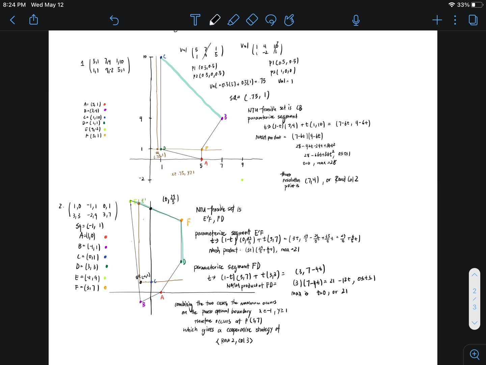
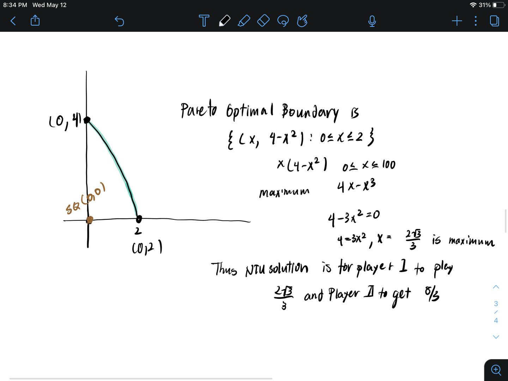

# 博弈论 hw11

计83 李天勤 2018080106

Barg1. Solve the following TU games. Find the Cooperative Strategy. TU Cooperative Value, Optimal Threat, Disagreement Point, Side Payment
$$
\begin{pmatrix} 3,2 & 5,1 \\ 0,0 & 1,4 \end{pmatrix}, \space
\begin{pmatrix} 7,4 & 2,8 \\ 4,5 & 5,6 \end{pmatrix}
$$
Matrix 1: 

1. Cooperative Strategy

We know that $\sigma = \max\{(a_{ij}, b_{ij}): i,j\}$  will give us the cooperative strategy. Just by looking at the matrix, we know that it is $\langle \text{Row 1}, \text{Col 2}\rangle $ with a value of $\sigma = 6$. 

Can be split into two matrix, $[A,B]$ where 
$$
A = \begin{pmatrix} 3 & 5 \\ 0 & 1 \end{pmatrix} , B = \begin{pmatrix} 2 & 1\\ 0 & 4 \end{pmatrix}
$$

$$
A - B = \begin{pmatrix} 1  & 4 \\ 0 & -3 \end{pmatrix}
$$

2. Optimal Threat Strategy

In order to get the optimal threat strategy, we simply solve for optimal strategies $p^*$ and $q^*$ of the 0-sum game $A-B$ for Players I and II respectively, represented as $\delta=\text{Val}(A-B)=p^{*T}(A-B)q^*$
$$
\begin{matrix} 
& q & 1-q \\
p & 1 & 4 \\
1-p & 0 & -3 
\end{matrix}
$$
We can see that Row 1 dominates Row 2, therefore eliminating row 2. Thus, the Optimal Strategies are $p^* = \langle 1,0 \rangle, q^* = \langle 1, 0\rangle$

This gives us $\delta = 1$

3. TU Resolution Point/TU Cooperative Value/TU Value 

The TU solution is equal to 
$$
\phi=(\phi_1, \phi_2) \\= (1/2(\sigma+D_1-D_2), 1/2(\sigma -D_1 + D_2)) \\ = (1/2(\sigma + \delta), 1/2(\sigma - \delta))
$$
where $D = (D_1, D_2) = D(p^*,q^*)$ is known as the Disagreement/Threat Point. 

$D_1 = p^{*T}Aq^*, D_2=p^{*T}Bq^*$, we get $D = (3, 2)$. 

Thus the solution is $(\frac{1}{2} (6 + 1), \frac{1}{2}(6 - 1))=(7/2, 5/2)$

Matrix 2

Using the same logic as above, we get that

$\sigma$ = 11 , Cooperative Strategy using $\lang\text{Row 1}, \text{Col 1}\rang$ (another possible strategy yielding the same payoff sum would be $\lang\text{Row 1}, \text{Col 2}\rang$)

$p^* = (0,1), q^*=(5/9, 4/9)$

$D_1 = 40/9, D_2 = 49/9$

$\delta = -1$

$\phi = (\tfrac{1}{2}(11 - 1), \tfrac{1}{2}(11 + 1)) = (5, 6)$ 

Barg2. Let $A$ be an $n \times n$ matrix. Consider the symmetric bimatrix $[A, A^T]$. Show that the payoff to Player I and Player II are equal in the TU Cooperative Value. 

The TU Cooperative Value is 
$$
\phi=(\phi_1, \phi_2) \\= (1/2(\sigma+D_1-D_2), 1/2(\sigma -D_1 + D_2)) \\ = (1/2(\sigma + \delta), 1/2(\sigma - \delta))
$$
thus, we have to prove that the disagreement point or threat points are equal, or that the value of the game is 0. 

The matrix $ A - A^T$ would look something like this 
$$
\begin{pmatrix} 0 & a \\ b & 0 \end{pmatrix}
$$
 In such a matrix game, the optimal/mixed strategies would be symmetric. If the optimal/mixed strategies are symmetric, so does the disagreement point/threat point, giving us a TU Cooperative Value where the payoff to Player I and Player II are equal

Barg3. Solve the following Nash Bargaining problems

1. $$
   \begin{pmatrix} 5,1 & 7,4 & 1,10 \\ 1,1 & 9,-2 & 5,1 \end{pmatrix}, SQ = \text{security level of I, security level of II}
   $$

2. $$
   \begin{pmatrix} 1,0 & -1,1 & 0,0 \\ 3,3 & -2,9 & 3,7\end{pmatrix}, \space SQ = (-1,1)
   $$

Barg4. Let $S=\{(x,y): 0 \leq y \leq 4 - x^2\}$ be the NTU-feasible set. Find the Nash Bargaining Solution if the status quo point is $(0,0)$

Barg5. Show that the Axiom of Invariance Under Change of Location and Scale is valid for the bargaining solution obtained from the Zeuthen's Principle.

Zeuthen's Principle

- the next concession must always come from the player with a smaller risk limit
- if the player's risks limits are equal, then both of them must make concessions to avoid conflict.
- Two players that act according to this principle will reach the Nash solution as their agreement point.

Based on Zeuthen's Principle,  new variances/transformations to the function $f(S, u^*, v^*)$ should not alter the outcome of the bargaining process.  The risk limits as discussed in Zeuthen's Principle can be represented by such changes in location and scale. 

Barg6. Finite Horizon Bilateral Bargaining

Using backward induction, we can determine the unique SPE. Given that T is 3, an odd value, we reach a stage where player 1 makes an offer in a period T in which no agreement has been reached. Player 2, in this case , is willing to accept any offer since she will get zero if she rejects the offer. Therefore player 1 will offer player 2 zero and player 2 will accept. The payoffs at this current stage in the game is $(\delta^{2}v,0)$ Now we analyze the subgame starting at T = 2, in which no previous agreement has been reached. In this subgame, Player 2 gets to make the offer. In a SPE, player 1 will accept any offer which is greater than or equal to the payoff he would get in the next round. Therefore, player 2 will offer player 1 $y$ such that $\delta^{1}y=\delta^2v$, and player 1 will accept. This would be the best possible offer, and since she does not want to be rejected because in the next period T = 3, she gets nothing. Therefore the payoffs in this period are $\delta^{1}y, \delta^{1}(v-\delta^1)y$, which is equal to $\delta^2v,\delta^2v-\delta^1v$. Finally,we reach when T = 0. In this case, no previous agreement has been reached, and player 1 gets to make an offer. Like before, in a SPE, player 2 will accept any offer that is greater than or equal to what she can get in the next period. Therefor player 1 will offer x such that $\delta^0=\delta^1v-\delta^2v$, and player 2 will accept. They payoffs are $\delta^0(v-x), \delta^0x$ which is simply equal to $\delta^0v-\delta^1v+\delta^{2}v, \delta^1v-\delta^2v$

## Personal Notes

cooperative feasible set - set of payoff vectors that the players can achieve if they cooperate

NTU or Non-Transferable Utility, feasible set is the convex hull of the $mn$ points, $(a_{ij}, b_{ij})$ for $i = 1, ...,m \space \text{and} \space j = 1, ..., n$ in the matrix $[A, B]$

TU or Transferable Utility, is the set where players may make **side payments** of utility as part of the agreement

TU feasible set is the convex hull of the set of vectors of the form $(a_{ij}+s, b_{ij} -s)$ for $i=1,...,m$ and $j=1, ...n$ and for the arbitrary real number $s$

Types of Agreements

1. Pareto Optimal - an agreement where no such player can be made better off without making at least one other player worse off (position that has a win-win move is not Pareto optimal)
   1. For more general convex feasible sets in the plane, the set of Pareto optimal points is the set of upper right boundary points.
2. Cooperative Strategy - agree to play to achieve the largest possible total payoff, $\sigma = \max\{(a_{ij}, b_{ij}): i,j\}$ as the payoff is divided between them
3. Disagreement/Threat Point, point in NTU feasible set where agreement is not reiched

