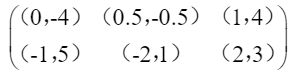
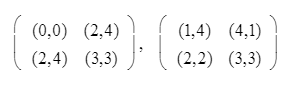

	# 博弈论 hw5

Ext8. 

Consider the game of 3-person Scissor-Rock-Paper such that each loser will pay $1 and the winner(s) will share equally on the payoff from the loser(s). 

Show that the strategy for each player to play the mixed strategy  (1/3, 1/3, 1/3) is a Strategic Equilibrium 

> personal notes:  main noncooperative solution concept is the strategic equilibrium (SE)

The payoff matrix's are as shown below

```
P1=Rock
                         P3

                Rock    Paper   Scissors
             ----------------------------
    Rock     |   0   |   -1   |    0.5  |
             |--------------------------|
P2  Paper    |  -1   |   -1   |    0    |
             |--------------------------|
    Scissors |  0.5  |    0   |    2    |
             ----------------------------

P1=Paper
                         P3

                Rock    Paper   Scissors
             ----------------------------
    Rock     |   2   |   0.5  |    0    |
             |--------------------------|
P2  Paper    |  0.5  |    0   |   -1    |
             |--------------------------|
    Scissors |   0   |   -1   |   -1    |
             ----------------------------

P1=Scissors
                         P3

                Rock    Paper   Scissors
             ----------------------------
    Rock     |  -1   |    0   |   -1    |
             |--------------------------|
P2  Paper    |   0   |    2   |   0.5   |
             |--------------------------|
    Scissors |  -1   |   0.5  |    0    |
             ----------------------------
```

however, the procedure for finding mixed strategies for 3+ players should not be any different than finding mixed strategy for 2 people. 

Knowing that the strategic equilibrium for a two person equilibrium is $(1/3, 1/3)$, and is derived by using the following equations: 
$$
V(q(rock)) = 0 * p(rock) + -1 * p(paper) + 1* p(scissor) \\
V(q(paper)) = 1 * p(rock) + 0 * p(paper) + -1 * p(scissor) \\
V(q(scissor)) = -1 * p(rock) + 1 *p(paper) + 0 * p(scissor) \\
且， p(rock) + p (paper) + p(scissor) = 1 \\
\therefore p(rock) = 1/3, \space p(paper) = 1/3, \space p(scissor) = 1/3
$$
The calculation is no different for 3 people, it just involves more variables

Let $p_i(s)$ be the probability that player $i=1,2,3$ plays action $s=r,p,s$ in order to get the mixed strategy (or strategic equilibrium 
$$
V(1,0,0) = 0 * p_2 (r) * p_3(r) +-1 * p_2(p) * p_3(p) + ...
$$
in the case where player 1 plays rock. Thus giving us the result that 3 person 

Ext9. 

Is the following game the strategic form of an extensive form game with perfect information? Draw the game tree if your answer is positive. Justify your answer if your answer is negative



> personal notes: PSE, pure strategic equilibrium
>
> - non-zero sum games of perfect information always have at least one PSE that may be found by method of backward induction
> - every extensive game (game tree) can be expressed as a strategic form game (game matrix)

I think the following game can be an extensive form with perfect information. Start with node with Player 1 with edges a and b (representing row 1 and 2), then its player 2's turn to make a decision, split those two nodes and have each of them have 3 edges, c, d, e. Each  of those choices representing the columns. Then simply label the terminal node with the above values.  The PSE of this game is row 1, column 3. 

Ext10. 

Suppose Alice and Bob form a team that we call Player I. Player II consists of Charles alone. The game is for Alice, Bob and Charles to call out “Heads” or “Tails” simultaneously. If the calls are the same, Player I wins. Otherwise, Player II wins. 

1. Draw the Kuhn tree. 

   

2. Show that Player I has a mixed strategy that wins with probability 0.5 but no behavior strategy that wins with probability greater than 0.25 

   As long as player 1, Alice and Bob, who currently on a team, call out either both heads or both tails, they have a 50 percent chance of winning. Looking at the Kuhn Tree, we can see that by looking at the two outer branches.  If player 1, choose HT, then they have no chance of winning. 

Bimat1. 

The Game of Chicken. Two players speed head-on toward each other and a collision is bound to occur unless one of them chickens out at the last minute. 

If both chicken out, everything is okay (they both win 1). If one chickens out and the other does not, then it is a great success for the player with iron nerves (payoff = 2) and a great disgrace for the chicken (payoff = −1). If both players have iron nerves, disaster strikes (both lose 2). 

1. Set up the bimatrix of this game. 
   $$
   \begin{matrix} & Don't \space Chicken \space Out & Chicken \space Out \\
   				
   				Don't \space Chicken \space Out & (-2,-2) & (2,-1) \\
   				Chicken \space Out & (-1,2) & (1, 1) 
   \end{matrix}
   $$
   where rows represent player 1, and column represents player 2

2. What are the safety levels, what are the maximin （safety）strategies, and what is the average payoff if the players use the maximin (safety) strategies?
   $$
   Player \space 1 = Val(A) = v_I = \max_p \min_j (p_1a_{1j} + ...+p_ma_{mj})
   $$

   $$
   A = \begin{pmatrix} -2 & 2 \\ -1  & 1\end{pmatrix}, \space Val(A) = -1
   $$

   since Column 1 dominates Column 2 (we can remove column 2)
   $$
   B = \begin{pmatrix} -2 & -1 \\ 2 & 1\end{pmatrix}, \space Val(B^T) = -1
   $$
   same reason as A. 

   Average payoff of the players are (-1, -1). after calculating $Val(A)$ and $Val(B)$

3. Find all SE's

   The payoff $(1, 1)$ from the second row, second column is rather stable and can be considered a strategic equilibrium since each player should believe that they should choose to Chicken Out. 

> personal notes: maximizing one's own payoff is no longer equivalent to minimizing the opponents payoff!


Bimat2.

For the following bimatrix games, find

1.  Security level for each player

2. Maximin (safety) strategies for each player



For first matrix, 
$$
A = \begin{pmatrix} 0 & 2 \\ 2 & 4 \end{pmatrix}, \space \space B= \begin{pmatrix} 0 & 4 \\4  &3 \end{pmatrix}
$$
$Val(A) = 2$, row 2 dominates row 1, remove row 1, thus guarantees at least winning 2 by using his/her maximum strategy at row 2.

$Val(B^T) = 16/5$, where player 2's maximin strategy is $(1/5, 4/5)$


For the second matrix
$$
A = \begin{pmatrix} 1 & 4 \\ 2 & 3 \end{pmatrix}, \space \space B= \begin{pmatrix} 4 & 1 \\2  & 3 \end{pmatrix}
$$
$Val(A) = 2$, column 1 dominates column 2, remove column 2, thus guarantees at least winning 2, by using his/her maximum strategy

$Val(B^T)= 5/4 $, maximin strategy for Player II is $(1/4, 3/4)$,