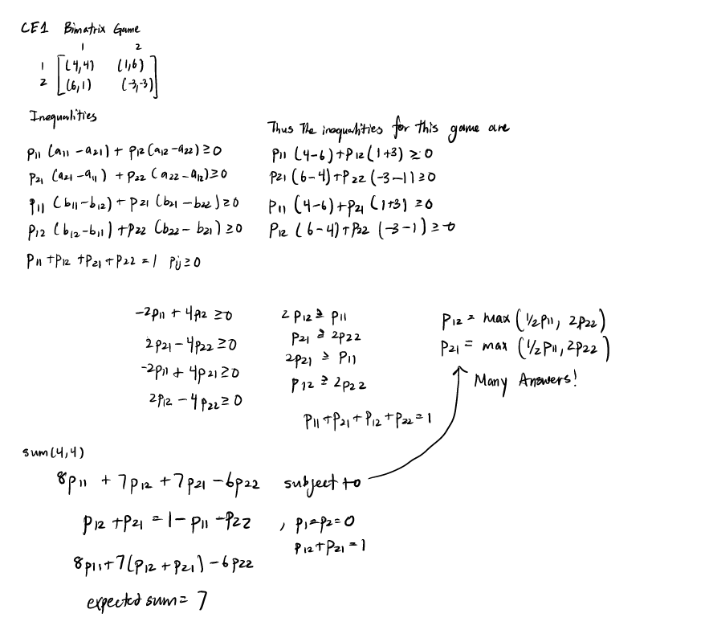
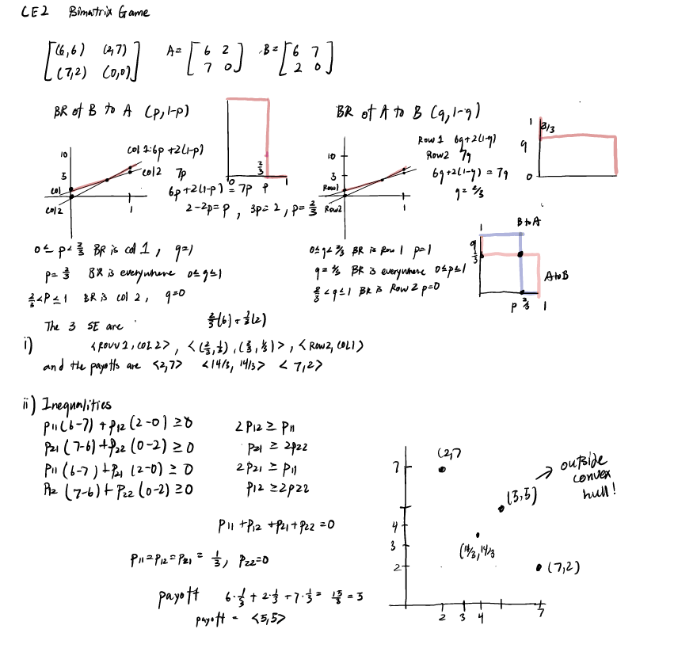
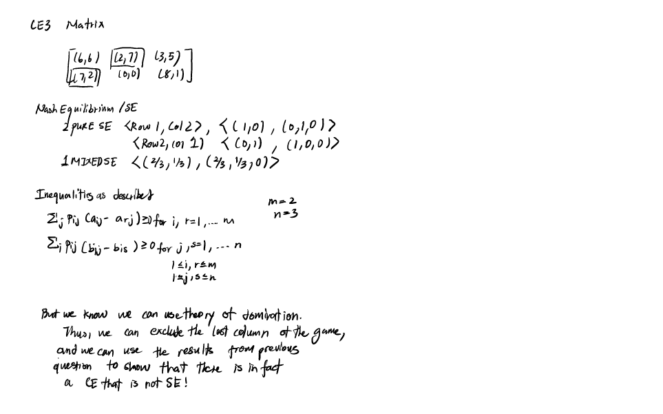

# 博弈论 hw7

CE1 Given the following bimatrix game

Find the correlated equilibrium that maximizes the expected sum of the two player's payoffs. 
$$
A = \begin{pmatrix} 4 & 1 \\ 6 & -3\end{pmatrix}, \space B = \begin{pmatrix} 4 & 6 \\ 1 & -3 \end{pmatrix}
$$

CE2 Given the following bimatrix  game

i. Find all SE using Tetraskelion method. Show that the payoff vectors of the SEs are $(2,7), (7,2), (14/3,14/3)$

ii. Show that there exists a correlated equilibrium such that its payoff vector is outside the convex hull of the payoff vectors of the three SEs in (i)

CE3 For the following $2 \times 3$ game, find a CE which does not come from a SE

CE4

Let $[A,B]$ be a bimatrix game such that both A and B are diagonal matrices with nonnegative diagonal entries. Show that any diagonal matrix $(p_{ij})$ such that $(p_{ij}) \geq \Sigma_{i,j}p_{ij}=1$, is a CE

If the elements off the diagonal are zero then there are no profitable deviations when the other player follows the correlated equilibrium:

Suppose player 2 follows the correlated equilibrium. Then you must prove that no other strategy will improve your payoff in expected value. Showing this is very simple in your case: suppose you get the ith signal. Player 2 will play his ith action and your best response is also to play your ith action since the payoff matrix is diagonal. Use this argument for each signal to see that the correlated equilibrium maximizes your payoff for each signal ii, so it must maximize your expected payoff as well。

Personal Notes

Correlated Equilibrium - generalizes Nash Equilibrium

