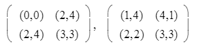
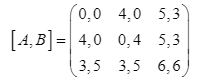
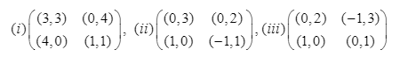
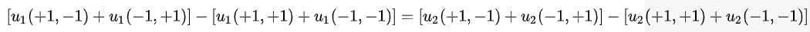

## 博弈论 hw6

complete bimatrix games assignment sheet

Bimat3. Find all SE's and the associated payoffs of the following bimatrix games

> SE: Strategic Equilbria (also known as Nash Equilibria) , PSE: Perfect Strategic Equilibria (special case of SE),
>
> PSE for 2 player
>
> - player 1's payoffs that is max of col
> - player 2's payoffs that is max of row

There is a pure strategic equilibrium in the first matrix located at $\langle 2, 1 \rangle$ with payoff $(2,4)$ . This is because if player 1 decides to switch rows (to row 1), his/her payoff decreases, and if player 2 decides to switch columns (to column 2) his/her payoff also decreases. 

In the second max, there exist no pure strategic equilibria, but a mixed strategic equilibria. Thus, we can split into two payoff matrices
$$
A = \begin{pmatrix} 1 & 4 \\ 2 & 3 \end{pmatrix}, \space B = \begin{pmatrix} 4 & 1 \\2 & 3  \end{pmatrix}
$$
Player one has mixed strategy of $(1/4, 3/4)$ with payoff of 2.5 (using matrix B)

Matrix B, the mixed strategy is $4q + (1-q) = 2q + 3(1-q), q = 1/2$, thus the strategy is for player 2 is $(1/2, 1/2)$ with a payoff of 2.5

Bimat4. Suppose that $\langle (p_1, ...,p_m)\rangle, \langle (q_1, ..., q_m)\rangle$, is a SE in bimatrix game. If $q_j$ are all positive, then show that $(p_1,...,p_m)$ is an equalizing strategy on the Column player's playoff matrix.

> Equalizing Strategy: gives you the same outcome, no matter what your opponent does (gives same average payoff to opponent no matter what opponent does)

If each player has an equalizing strategy for the other player's matrix, then that pair of strategies forms an equilibrium. This is because if an opponent uses a strategy that makes it not matter what you do, then anything you do is a best response, in particular the equalizing strategy on the opponents matrix. Thus, if $\langle (p_1, ...,p_m)\rangle, \langle (q_1, ..., q_m)\rangle$ is a SE, then $(p_1,...,p_m)$ becomes equalizing strategy to Columns playoff. 

Bimat5. Let $[A, B]$ be a a bimatrix game. This game is called a Symmetrix bimatrix game if $A, B$ are square matrix such that $B = A^T$. Show that for a Symmetrix bimatrix game if $<p,q>$ is a SE then so is $<q,p>$ 

> Symmetrix Games: an idealization in which we take the roles and preferences of the players to be identical. 

The players are treated as independent parties, but, as they are the same, they would make the same choice when confronted with the same situation. Their observation and ideologies would be the same. Thus, their choice would also be a symmetric Nash equilibrium. In a symmetric game, any equilibria that is not symmetric can be ruled out. Thus if $\langle p , q\rangle$ is the SE, and $p$ is symmetric/identical to $q$ , then $\langle q, p \rangle$ would also be the same.

Bimat6. A completely mixed strategy is defined to be a mixed strategy assigning positive probability to each of the player's pure strategies. If each player's playoff matrix in a bimatrix game is nonsignular (invertible), show that the game can have at most one SE in which both players use completely mixed strategy (when all the probabilities are equal)

Show that the only SE for the following 3x3 game must be completely mixed. Find this completely mixed SE. 

$$
\begin{pmatrix} 4,5^* & 0,0 & 5^*,4 \\ 5^*,4 & 4,5^* & 0,0 \\ 0,0 & 5^*,4 & 4,5^* \end{pmatrix}
$$
There are no PSEs.

This 3x3 game has a completely mixed strategy equilibrium of $(1/3, 1/3, 1/3)$

Bimat7. Consider the 3x3 bimatrix game

Let $<p,q>$ be Nash equilibrium in $[A, B]$. Let $C(p)$ be the set of best reply columns with respect to $p$.

1. Prove that $\{Col1, Col2\}$ is not a subset of $C(p)$
2. Prove that $C(p)$ is not equal to $\{Col2, Col3\}$
3. Find all Nash Equilibria of  this game

Nash Equilibrium

- Player 1 Strategy $(0,0,1)$ with payoff of 6
- Player 2 Strategy $(0,0,1)$ with payoff of 6 

Looking at the Nash Equilibria, it is clear to see how the first two are true.

Bimat8 

1. Suppose in a Cournot model that the price function is $max((a - q),0)$ where $q$ is the total quantity in the market. Suppose the firms that have different production costs. Let $c_1$ and $c_2$ be the costs of production per unit for firms 1 and 2 respectively, where both $c_1$ and $c_2$ are assumed less then $a/2$. Find the Cournot equilibrium
2. What happens, if in addition, each firm has a setup cost? Suppose Player I's cost of producing $x$ is $x+2$, and II's cost of producing $y$ is $3y+1$. Suppose also the price function is $p(x,y)=17-x-y$, where $x$ and $y$ are amounts produced by I and II respectively. What is the equilibrium production, and what are the player's equilibrium payoffs?

In the Cournot model, firms compete on the amount of output they will produce, and the quantity to be produced by both firms is decided simultaneously and independent of one another.

Profit function of each firm is given as 
$$
\pi_1 = (a - bq_1 - bq_2)q_1 - c_1 q_1 
$$

$$
\pi_2 =(a-bq_1 - bq_2)q_2 - c_2q_2
$$

If we differentiate both, we get 
$$
\pi'_1(q_1) =a - 2bq_1 - bq_2 - c_1 = 0
$$

$$
\pi'_2(q_2) =a - bq_1 - 2bq_2 - c_2 = 0
$$

Solving for the equation, we get ,
$$
q_1 =\frac{a-2c_1 +c_2}{3b}, q_2=\frac{a-2c_2-c_1}{3b}
$$

 

Bimat9. Which of the following bimatrix games are potential games? If it is a potential game, find a potential. Otherwise, explain why it is not a potential game

> a **game** is said to be a **potential** **game** if the incentive of all players to change their strategy can be expressed using a single global function called the **potential** function. 

1. is a potential game

2. not a potential game, A 2 player, 2-action game cannot be a potential game unless 

   

3. is a potential game

I am not sure how I would get the potential function/matrix without the specific action choices for each. I attempted finding the Potential function using systems of equations derived from the payoff function
$$
u_i(a_i,a_j) =b_ia_i+wa_ia_j
$$
and the potential function 
$$
P(a_1, a_2) = b_1a_1 + b_2a_2 + wa_1a_2
$$
where $a_i,a_j$ represents the action choices, w represents a positive externality from choosing the same action. For the first matrix, I attempted using the SE of $(1,1)$ but could not derive the potential functions.

Personal Notes

> dominant strategy is optimal move for an individual regardless of how other players act, nash equilibrium describes the optimal state of game where both players make optimal moves but now consider moves of opponent

> payoff function is noted as $u(...)$
>
> Potential Function $P(...)$

