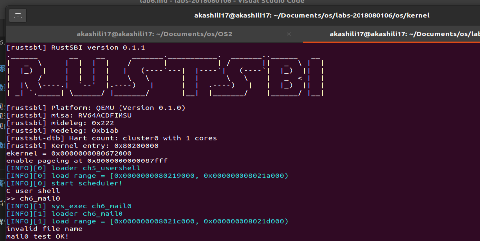

# 操作系统 lab6

## 实验要求

1. 实现分支：ch6。
2. 实现进程控制，可以基于 pipe 进行进程通信。
3. 实现邮箱机制及系统调用，并通过 [C测例](https://github.com/DeathWish5/riscvos-c-tests)中 chapter6 对应的所有测例。

## 实验结果

Based on the results, we can see that the program is almost correct. I ran out of time and could not fix a bug that gave us an invalid file name.



## 问答作业

1. 举出使用 pipe 的一个实际应用的例子。

   【解答】

   ```
   ps -aux | grep qemu
   ```

   The pipeline input is PS command to view all process status, and the input is string matching QEMU keyword. qrep represents global regular expression print.

2. 假设我们的邮箱现在有了更加强大的功能，容量大幅增加而且记录邮件来源，可以实现“回信”。考虑一个多核场景，有 m 个核为消费者，n 个为生产者，消费者通过邮箱向生产者提出订单，生产者通过邮箱回信给出产品。

   - 假设你的邮箱实现没有使用锁等机制进行保护，在多核情景下可能会发生那些问题？单核一定不会发生问题吗？为什么？

     【解答】

     In a multi-core system, multiple process write to the the mailbox of the same process in parallel. This may cause the same mail to be written, and the content of the order received by the process to be aliased.

     In a single system, where there is no parallelism, and only concurrency, there still may be problems. For examples, a process has just received the reply address but has not yet started writing, causing the address to remain in the UNUSED state, and then the process is scheduled by the OS. If another process uses the same address when replying, there will be a conflict write situation.  However, in our implementation, it is the user mode that allows S mode to take over the clock interrupt by setting sie. After entering the kernel mode, the machine turns off the interrupt enable, causing  sys calls to become atomic operations, removing the problems of conflicts.

   - 请结合你在课堂上学到的内容，描述读者写者问题的经典解决方案，必要时提供伪代码。

     【解答】

     Using a mutex, each access to the mail by a process must first take the lock and then perform read/write operations, and then release it after completion, as follows:

     ```
     mutex.lock();
     // read / write
     mutex.release();
     ```

- 由于读写是基于报文的，不是随机读写，你有什么点子来优化邮箱的实现吗？

  【解答】

  Allow user to read and write in the message in segments, and support the cursor to move to the designated position of the mail to start reading/writing, so that reading and writing can be accelerated by multi-core.