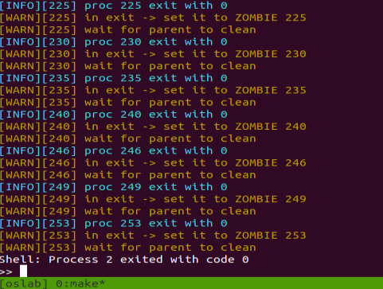

# 操作系统 lab8

计83李天勤201808016

## 实验目的

Analyze the lab experiments 1 to 8 and their corresponding test cases to improve the quality of the operating system. 

1. git checkout -b ch8
2. run lab 8 test cases and analyze the result of some chapter 8 test cases on the lab7 version of the operating system, figure out why lab7 OS does not support the lab8 applications and find reasons for memory failures, panics, and more.

In this experiment, I only realized test cases one and two, but will try to explain the theory behind implementing the other tests cases.

## 实验实现

### ch8_01

This test case creates a `fork` bomb, that exponentially allocates a large number of process. The error that I had received was 

```
...
[INFO][184] fork!
[INFO][184] proc 184 exit with 0
[INFO][185] fork!
[rustsbi-panic] system shutdown scheduled due to RustSBI panic                                [INFO][186] fork!
[ERROR][186] panic: allocproc
```

In order to solve this problem, we have to prevent panic, and return -1 instead. However, the process pool is still full after ch8_01 because of a zombie process. Thus, it cannot continue to run other processes (however this was implemented).  We set the proc to zombie. The result is as shown, 



### ch8_02

This test case was a `mmap` problem. It had too large amount of memory, causing the following problem

```
[ERROR][6] memory run out
[ERROR][6] memory run out
[ERROR][6] memory run out
[ERROR][6] memory run out
... (keeps going)
```

This is caused by memory page allocation. In order to solve this problem, we have to follow the OOMKiller principle to directly exit when the allocation fails, thus forcible terminating the program. The result is as shown, 


### ch8_03

The problem with this test case was that the program used permissions, causing the following problem

```
[rustsbi-panic] hart 0 panicked at 'invalid instruction, mepc: 00000000000010ec, instruction: 
0000000000000000', platform/qemu/src/main.rs:458:17
[rustsbi-panic] system shutdown scheduled due to RustSBI panic
```

The reason for this is because of the following line

```c++
sys_get_time((void *)get_pc() + 8, -1);
```

This line writes the current time to the next line of instructions, resulting in an error in the execution of instructions

### ch8_04

This test case is a range check of multiple functions such as file reading, file writing, creating new files, deleting files, mailbox reading, and mail box writing, and more. Running the testcase of lab7 os resulted in 

```
C user shell                                                              
>> ch8_04
[INFO][1] fork!
[INFO][2] sys_exec ch8_04
[INFO][2] loader ch8_04

[INFO][2] load range = [0x000000008024a000, 0x000000008024c000)
GOOD LOCK
[ERROR][2] invalid trap from kernel: 0x000000000000000d, stval = 0x0000000000000000 sepc = 0x0000000080201928
[INFO][2] proc 2 exit with -1
Shell: Process 2 exited with code -1
```

In order to solve for this, we simply have to add a correct range check for each system call, and if the range is not correct, we output -1. 

