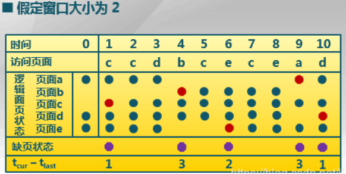

# 3.15 第7讲 

Storage virtualization is the pooling of physical storage from multiple storage devices into what appears to be a single storage device -- or pool of available storage capacity -- that is managed from a central console. The virtual storage software intercepts input/output (I/O) requests from physical or virtual machines and sends those requests to the appropriate physical location of the storage devices that are part of the overall pool of storage in the virtualized environment. To the user, the various storage resources that make up the pool are unseen, so the virtual storage appears like a single physical drive, share or logical unit number (LUN) that can accept standard reads and writes.

# 虚拟存储：局部页面置换算法

https://baike.baidu.com/item/%E9%A1%B5%E9%9D%A2%E7%BD%AE%E6%8D%A2%E7%AE%97%E6%B3%95

缺页： Page fault interruption means that the page to be accessed is not in the main memory, and the operating system needs to transfer it to the main memory before accessing it. At this time, the [memory- ](https://baike.baidu.com/item/内存/103614)[mapped](https://baike.baidu.com/item/映射/20402620) file actually becomes a paging file.

页面置换算法的概念（局部）- page replacement algorithm 

> Paging is a **storage mechanism** that allows OS to retrieve processes from the secondary storage into the main memory in the form of pages. In the Paging method, the main memory is divided into small fixed-size blocks of physical memory, which is called frames

功能： During the address mapping process, if it is found in the page that the page to be accessed is not in the memory, a [page fault interrupt](https://baike.baidu.com/item/缺页中断/5029040) is generated . When a page fault occurs, if there are no free pages in the [operating](https://baike.baidu.com/item/操作系统/192) system's memory, the [operating system](https://baike.baidu.com/item/操作系统/192) must select a page in the memory to move it out of the memory to make room for the page to be loaded. The rule used to choose which page to eliminate is called the page replacement algorithm.

设计目的：尽可能减少页面的调入调出次数

frame locking : page currently stored in that frame my not be replaced

OPT：最有页面置换算法 (optimal)

- 置换再未来最长时间不访问的页面，remove the page that won't be used for the longest time
- most optimial, but algorithm is impossible to implement, os cannot known will be accessed next

FIFO: 先进先出 first in first out

- 选择再内存
- selects page that enters the memory first, and then exists the memory first: reason: first page transferred into memory is more likely to be no longer used than it is just transferred into memory

LRU: 最近醉酒未使用 least recently used

- if recent past is used as an approximation of the near future, then pages that have not been used for the longest period of time in the past can be replaced.

- When a page fault occurs, the page being pointed to by the hand is inspected. If its *R* bit is 0, the page is evicted, the new page is inserted into the clock in its place, and the hand is advanced one position. If *R* is 1, it is cleared and the hand is advanced to the next page. This process is repeated until a page is found with

  *R* = 0. Not surprisingly, this algorithm is called **clock**. 

CLOCK： 始终页面支置换算法

- https://cs.stackexchange.com/questions/24011/clock-page-replacement-algorithm-already-existing-pages#:~:text=The%20clock%20replacement%20algorithm%20is%20trying%20to%20achieve,in%20memory%20and%20the%20recently-used%20bit%20is%20true.

改进的CLOCK算法

LFU： 最不常用的算法

- a shift register should be set for each page in the memory to record how often the page is accessed.

Belady

https://prepinsta.com/operating-systems/beladys-anomaly/

# 3.18 第8讲

https://blog.csdn.net/lililuni/article/details/83685463

# 虚拟存储：全局页面置换算法

> In the local algorithm （局部置换）, the memory access difference between each process is not considered, and the global replacement algorithm allocates a variable number of physical pages (物理页面) for the process. The resident set （常驻集）refers to the set of pages that actually reside in the memory at the current moment when the process is running. The working set （工作集）is an inherent feature of the rerun process. The job of the replacement algorithm is to determine the size of the resident set （常驻集） and the corresponding page on the premise of the working set of the process.

工作集 - 一个进程当前工作正在使用的逻辑页面集合，可以表示为二元函数$W(t,\Delta)$

>  set of pages in the virtual address space of the process that are currently resident in physical memory

- t 是当前的执行时刻
- $\Delta$ 称为工作集合窗口（working-set window), 即一个定长的页面访问时间窗口

工作集 - 缺点： 访问页面时开销比较大，

常驻集 - 在当前时刻，进程实际驻流

> is that portion of the process image that is actually in real-memory at a particular instant, working set is subset of resident set that is actually needed for execution

缺页率 page fault rate

- 缺页次数/内存访问次数， 
- 缺页平均时间间隔的倒数

常驻集 $\supseteq$ 工作集时，缺页较小,

！！ 通过调节常驻集大小，使每个进程的缺页率保持在一个合理的范围内。。。

### 缺页率置换算法的实现

缺页率置换

>1. 时刻1，出现缺页，之间补页面
>
>2. 时刻2，正常访问，时刻3也是正常访问
>
>3. 时刻4，访问b时出现缺页，把b补进来，此时缺页时间间隔是3，大于窗口大小2，将两个缺页之间没有访问的页面剔除出去，也就是剔除a、e。后面类似，在时刻6时，缺页间隔为2，不进行剔除。
>
>   

## 抖动和负载控制

Thrashing: 系统中的进程数目很多

- 物理页太少了，不能包含工作集

负载控制

> Hope that the size of the memory is exactly the sum of the working sets of all current processes. At the same time, when the page fault interval (缺页间隔) is greater than the page fault exception processing time, the processor has time to deal with the page fault. If it is less than the page fault, it runs at full capacity and cannot be processed. So find a load balancing point so that the two are exactly equal.

MTBF = PFST

## 面向缓存的页替换FBR

https://www.ahirlabs.com/notes/operating-system/thrashing/#:~:text=%20Thrashing%20in%20Operating%20System%20%201%20Thrashing,out%20is%20required%20for%20execution%20and...%20More%20

thrashing is the situation where process spends more time in processing page faults than executing the instructions of process

## 面向缓存的页替换算法 LRU-K 2Q

## 面向缓存的页替换算法 LIRS

