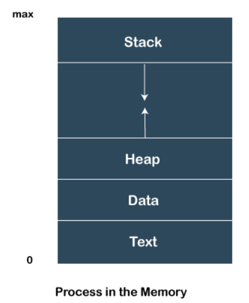

# 3.22 第9讲

# 进程，线程和协程

#### process vs thread vs coroutine

process is an instance of program that is being executed (execution steps)

- 进程式指一个具有一定独立功能的程序在一个数据集合上的一次动态执行过程
- 所有信息：代码，数据，堆栈，状态寄存器，通用寄存器，。。。
- PCB process control block 
- 进程的生民周期划分：创建，执行，等待，抢占，晚醒，结束

- (parent) process can create other process (clone/child) to perform multiple tasks at a time, each of which containing its own memory space that is not shared with other processes. 

  

- have 5 states, NEW, READY, RUNNING, WAITING, TERMINATED 
- 进程挂起 add 2 more states
- resource required by program provided by OS, such as register (instruction, storage address, etc), program counter, and a stack. 
- fork() function creates process

thread is a subset of a process

- 线性式进程的一部分，描述指令流执行状态。它式进程中的指令执行流的基本单元，是CPU调度的基本单位

- process can have multiple threads (managed independently by the schedule), threads of one process are interrelated to each other
- process scheduling https://www.tutorialspoint.com/operating_system/os_process_scheduling.htm
- have shared information such as data segment, code segment, files, etc, that is shared to their peer threads, but contains its own register, stack, and counter

- two types of threads:

  - user level thread - managed by user, information not acceesed by kernel, faster, easier to create and manage, kernel takes all these threads as a single process, implemented by user-level libraries, not system calls

  - kernel level thread - handled by OS, managed by kernel, slower, system calls

## 进程 process

## 线程 thread

用户线程 user thread

内核线程 

TCB - thread control block - similar to PCB

OS switches running threads preemptively according to its scheduler, which is an algorithm in the operating system kernel

- with couritines, the programmer and programming language determine when to swtich couroutines, tasks are cooperatively multitasked by pausing and resuming functions at set points (typically ,but not necessarily within a single thread)

## 协程 coroutine

user level 

> coroutines are computer program components that generalize subroutines for non-preemptive multitasking, by allowing execution to be suspended and resumed.

a form of sequention processing ? 

currented limited to programming language

# 3.25 第10讲

# 进程，线程，与协程的实现

## 进程实现

## rCore进程管理

## 用户线程的实现

## Rust语言线程管理和实现

