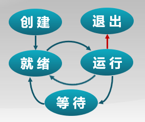
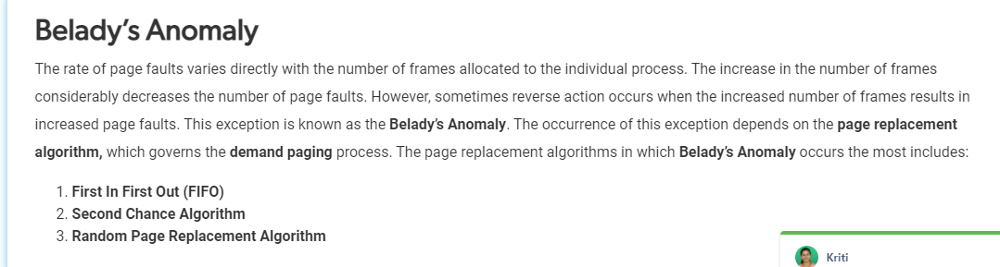
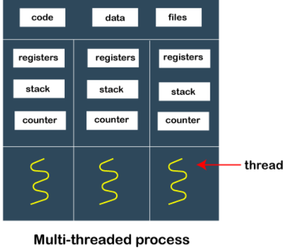
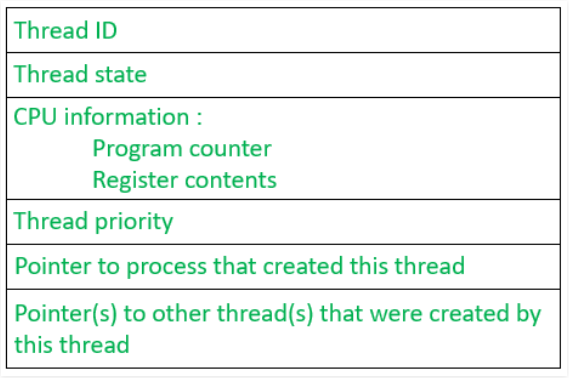
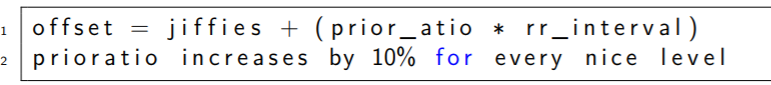

# 操作系统 1-8

# Week 1

## 操作系统概述

what is operating system? 操作系统是一个管理硬件资源，控制程序运行，改善人机界面和为应用软件提供支持的一种系统 （also an interface between hardware and system/user applications)

characteristics of OS? parallelism, mutual exclusion and shared data, virtual, asynchronous

history? 

## 中断，异常，与系统调用

### what is system call? 系统调用

> is the programmatic way in which a computer program requests a service from the kernel of the operating system on which it is executed. This may include hardware-related services (for example, accessing a hard disk drive, creation and execution of new processes, and communication with integral kernel services such as process scheduling. System calls provide an essential interface between a process and the operating system.

a program is limited to its own address space so it cannot access or modify other running programs or the operating system itself. It is also often prohibited from making changes to hardware directly. however, as many programs needs these components (other programs/OS/hardware), systems calls are made available (and often initiated through interrupts) by the operating system to provide safe implementations for such operations.

> An interrupt automatically puts the CPU into some elevated privilege level and then passes control to the kernel, which determines whether the calling program should be granted the requested service. If the service is granted, the kernel executes a specific set of instructions over which the calling program has no direct control, returns the privilege level to that of the calling program, and then returns control to the calling program.

- 6 major system call categories: process, file management, information maintenance, communication, protection

### what is isolation? 隔离

> software/hardware technologies to protect processes from affecting other processes and devices  (and vice versa)

protects process A from writing to process B

- can be implemented with Virtual Address Space, where address A's address space is different from B's address space, thus A cannot write to B
- disallow inter-process memory access

prevents virus, bugs, and processes from affecting operating system

### virtual memory vs physical memory?

Virtual memory is an abstraction to give the programmer the illusion of having infinite memory available on their system.

Virtual memory mappings are made to correspond to actual physical addresses. The **operating system** creates and deals with these mappings - utilizing the page table, among other data structures to maintain the mappings. Virtual memory mappings are always found in the page table or some similar data structure (in case of other implementations of virtual memory, we maybe shouldn't call it the "page table"). The page table is in physical memory as well - often in kernel-reserved spaces that user programs cannot write over.

### what is paging?

most common memory management technique

- virtual space of process divided into fixed size "pages"
- virtual address composed of page number and page offset
- physical memory divided into "frames"
- page in virtual memory fits into frame of physical memory

each process has an associated page table! Mappings from VA to PA are done with page table.

virtual page number vs physical page number? VPN vs PPN?

transition lookaside buffer TLB? 

- memory [cache](https://en.wikipedia.org/wiki/CPU_cache) that is used to reduce the time taken to access a user memory location, part of MMU
- stores the recent translations of [virtual memory](https://en.wikipedia.org/wiki/Virtual_memory) to [physical memory](https://en.wikipedia.org/wiki/Physical_memory) and can be called an address-translation cache

### privileges 

kernel mode 

- OS runs on kernel mode

user mode

- user applications run on user mode

### what is interrupts? 中断? 

interrupts occur asynchronously from I/O devices outside the processor

exception handler is usually called the interrupt handler (the I / O device sends a signal to a pin of the processor chip and puts the exception number on the system bus to trigger the interrupt)

- After the current instruction is executed, the processor reads the exception number from the system bus, saves the field and switches to kernel mode;
- Call the interrupt handler. When the interrupt handler is finished, it returns the control to the next instruction to be executed.

Timer can generate interrupt stably and regularly

- prevent application from occupying CPU
- enable OS kernel to manage resources periodically

### interrupts vs traps

A **[trap](http://en.wikipedia.org/wiki/Kernel_trap)** is an exception in a user process. It's caused by division by zero or invalid memory access. It's also the usual way to invoke a kernel routine (a [system call](http://en.wikipedia.org/wiki/System_call)) because those run with a higher priority than user code. Handling is synchronous (so the user code is suspended and continues afterwards). In a sense they are "active" - most of the time, the code expects the trap to happen and relies on this fact.

An **[interrupt](http://en.wikipedia.org/wiki/Interrupt)** is something generated by the hardware (devices like the hard disk, graphics card, I/O ports, etc). These are asynchronous (i.e. they don't happen at predictable places in the user code) or "passive" since the interrupt handler has to wait for them to happen eventually.

You can also see a trap as a kind of CPU-internal interrupt since the handler for trap handler looks like an interrupt handler (registers and stack pointers are saved, there is a context switch, execution can resume in some cases where it left off).

# Week 2

## 进程与调度

### what is a process?

process contains all the status information of a running program, including code, status registers CRO/IP, general purpose registers, system resources being used

characteristics

1. dynamic creation/ending
2. parallelism
3. 独立性
4. 制约性 Constraints due to access to shared data / resources or inter process synchronization

进程是一个状态编程的过程， process consists of program, data, and process control block

### what is process block?

it is a data structure used by OS to store all the information about a process (each process has a single PCB)

- when a process is created (initialized or installed), the operating system creates a corresponding process control block.
- information in a process control block is updated during the transition of process states.
- when the process terminates, its PCB is returned to the pool from which new PCBs are drawn.

information can be classified into three main categories

1. process identification
2. process state
3. process control

### what are the process states?

NEW, READY, RUNNING, TERMINATED, BLOCKED



```
创建 --> 就绪
```

system initialization, user request new process, running process performed the system call that created the process

```
就绪--> 运行
```

kernel selects ready process to occupy the processr and execute it

```
运行 --> 等待
```

enter waiting phase for some reasons. ie. required data did not arrive

```
运行 --> 就绪
```

process will be preempted? when the running process runs out of time slots allocated to it

``` 
等待 --> 就绪
```

process is awaken,  when a process is waiting for an event to arrive, it changes from a blocked state to a ready state

```
运行 --> 结束
```

process ends for some reason (1) normal exit (2) error and exiting (3) fatal error (强性的) (4) etc

### what is process switching?

process switch is the shifting of operating system scheduler from one running program to another. This requires saving all the states of currently executing program, including register states, associated kernel states, and all of its virtual memory states. All these states of a new program are then loaded and the execution continues.

- save the execution context (CPU state) of the current process in PCB
- restores the execution context of the next process

## 进程调度

### what is scheduler? 可抢占系统？

process scheduler is a part of the operating system that decides which process runs at a certain point in time. It usually has the ability to pause a running process, move it to the back of the running queue and start a new process; such a scheduler is known as a *[preemptive](https://en.wikipedia.org/wiki/Preemption_(computing)) scheduler*

process switching? context switching? 上下文切换?

### what are the scheduling disciplines?  

know how to calculate average waiting times!!!

先来先服务调度算法 First Come First Serve, FCFS

- queues process in the order they arrive in
- no reorganization, scheduling overhead is small, is simple 
- throughput can be low, because long processes can be holding the CPU, causing short process to wait a long time (known as convoy effect). no prioritization, long waiting times, inefficent use of CPU and I/O resources

时间片轮转调度算法 Round Robin 

- scheduler assigns a fixed time unit per process, and cycles through them. If process completes within that time-slice it gets terminated otherwise it is rescheduled after giving a chance to all other processes.
- large overhead, especially with small time slice
- shorter process faster than FCFS, long processes faster than SJF
- time slace is small -> lots of switching, time slice is too large --> waiting time is very large

## 进程切换与管理

### fork vs exec

The ```fork``` call basically makes a duplicate of the current process, identical in *almost* every way such as CPU registers, variables, and memory. Not everything may be copied (because of limtied resources) but close of copy as usual. Virtual memory pages in both process may refer to the same pages of physical memory until one of them writes to such a page, then it is copied

The new process (child) gets a different process ID (PID) and has the PID of the old process (parent) as its parent PID (PPID). Because the two processes are now running exactly the same code, they can tell which is which by the return code of `fork` - the child gets 0, the parent gets the PID of the child. This is all, of course, assuming the `fork` call works - if not, no child is created and the parent gets an error code.

The `exec` call is a way to basically replace the entire current process with a new program. It loads the program into the current process space and runs it from the entry point.

forking is expensive!!!, 99% of time when forking, we call exec after

- vfork()

### wait and exit

```wait``` syscall is used by parent process to wait (enter 等待 status) for end of child process. 

```exit``` performed by child, wakes up parent process, and completes process resource recycling

## 同步互斥与进程间通信

### why inteprocess communication?

indepndent process do not share resources/status to other processes, thus when it comes to parallel process, process have to communicate in order to maintain 确定性 and 可重现性

### what is atomic operation 原子操作?

operation that will always be executed without other process being able to read or change state that is read or changed during the operation

- single processor core systems using single CPU instruction (and disabling interruptions if multiple CPU instructions are required)
- multiprocessor/multicore: use a lock on the bus (communication link used in cs to send data, addresses, control signals, and power to various components in a computer system)

### what is critical section 临界区? 

```
entry section -  check whether or not code can enter critical section
	critical section
exit section - clear "accessing crtical section" tag
	remainder section
```

critical section - protected section that cannot be executed by more than one process at a time (shared resources that are continuously accessed, causing unexpected or erroneous behavior)

- 空困则入 - no process has entered critical section, any process can enter
- 忙则等待 - a process has enterted critical section, no other process can enter
- 有限等待 - a process waiting to enter critical section cannot wait forever
- 让权等待（可选）process that cannot enter crtical section, 解放 CPU

### what is synchronous mutix? 

mutex? multiple threads, one "mutex", thread that has the "mutex" can do the work, moderator is the operating system, when thread is done with work, hand "mutex" back to moderator who will pass the "mutex" to the next thread.

### mutual exclusion vs deadlock vs starvation

starvation is caused by errors in scheduling or mutual exclusion algorithm, where a process is perpetually denied necessary resources to process its work. 

### methods of synchronization?

1. disable hardware interrupts - no interupts, no switching, no concurrency

   1. negatives - stop whole system, other process may be starved, critical section may be long

2. interprocess communication - IPC

3. pipe - 管道 - communication based on memory file

   1. > more specifically, the pipe() syscall creates two file descriptors, which the process can write() to and read() from. Since these file descriptors are preserved across fork() calls, they can be used to implement inter-process communication

### what is blocking synchronous process and non-blocking asynchronous process communication?

Blocking is considered **synchronous** and **blocking send** means the sender will be blocked until the message is received by receiver. Similarly, **blocking receive** has the receiver block until a message is available. Non-blocking is considered **asynchronous** and Non-blocking send has the sender sends the message and continue. Similarly, Non-blocking receive has the receiver receive a valid message or null.

## 计算机体系结构和内存层次

## 内存分配

### physical memory vs logical memory?

physical memory is address space supported by hardware

logical memory is address space that is visible to CPU running a process

operating systems helps map LA and PA

内存/外部碎片 - memory fragmentation, space that cannot be utilized

### what is dynamic partitioning 动态分区分配?

when the program is loaded and executed, allocate a partition (block, memory block) with variable size specified by the process, address is continuous 

### why not continuous allocation?

physical memory allocated must be continuous, lots of external/internal fragments, difficult, low memory utilization

discountinuous allocation -improve memory utilization and management flexibility, share code and data, support dynamic loading and linking

### segementation vs paging?

Paging is a memory management technique in which process address space is broken into blocks of the same size called pages (size is power of 2, between 512 bytes and 8192 bytes). The size of the process is measured in the number of pages.

Segmentation, a process address space is broken in varying sized blocks called sections. Sections include the main function, stack, heap, data structures, etc... assigning to each unit in a process an address space, so they are allowed to grow. This is more flexible. (from logical address to physical address

## 页式存储管理

### what is paging?

A **page**, **memory page**, or **virtual page** is a fixed-length contiguous block (sharing common border) of virtual memory, described by a single entry in the page table. It is the smallest unit of data for memory management in a virtual memory operating system.

- page offset = frame offset
- page size != frame size


### what is page frame?

Similarly, a **page frame** is the smallest fixed-length contiguous block of physical memory into which memory pages are mapped by the operating system.

main memory is split into frames, and the address is noted as $(f,o)$ where f stands for frame id, and o stands for offset


### what is page table?

A page table is the data structure used by a virtual memory system in a computer operating system to store the mapping between virtual addresses and physical addresses

## 虚拟内存

### what is virtual storage?

save some memory blocks not commonly used to external memory, only pages/segments needed are loaded into internal memory

管理

```
On the basis of page storage management, add request page adjustment and page replacement
1. When the user program is to be loaded into the memory to run, only part of the page is loaded and the program is started to run
2. When the process finds that the required code or data is not in memory, it will send page missing exception request to the system
3. When the operating system handles the page missing exception, it calls the corresponding page in the external memory into the memory, so that the process can continue to run
```

### what is page fault?

>  is a type of exception raised by computer hardware when a running program accesses a memory page that is not currently mapped by the memory management unit  (MMU) into the virtual address space of a process. Logically, the page may be accessible to the process, but requires a mapping to be added to the process page tables, and may additionally require the actual page contents to be loaded from a backing store such as a disk. The processor's MMU detects the page fault, while the exception handling software that handles page faults is generally a part of the operating system kernel. When handling a page fault, the operating system tries to make the required page accessible at the location in physical memory or terminates the program in cases of an illegal memory access.

## 文件系统

### how to represent the location and order of data blocks assigned to a file

1. 连续分配 - file header specifies starting block and length
2. 链式分配 - like linked list, file header specifies head and tail
3. 索引分配 - every file creates 索引数据块, which contains index of all the blocks

# Week 3

## 连续内存分配

### methods of continuous memory allocation?

最先匹配 First Fit Allocation

- simple, large, free partitions in high address spaces
- external fragmentation, allocating large blocks is slow

最哇匹配 Best Fit Allocation

- simple, good when allocating blocks are small
- external fragmentation, slow release of partitions, lots of small, useless partitions

最差匹配 Worst Case Allocation

- best when lots of middle sized blocks being allocated, prevents lots of small partiions
- external fragmentation, slow release of partions, breaks up large partitions

### methods of reorganizing fragmentations?

紧凑 compaction - shuffle memory contents to place all free memory together in one large block.

分区对换 swapping in/out - add a 对换等待 state, swap out a process for another

### what is the buddy system  伙伴系统? 

Buddy allocation system is an algorithm in which a larger memory block is divided into small parts to satisfy the request. This algorithm is used to give best fit. The two smaller parts of block are of equal size and called as buddies. In the same manner one of the two buddies will further divide into smaller parts until the request is fulfilled. Has to be a $2^U$ 块


## SLAB 分配器

### what is slab allocation?

> **Slab allocation** is a memory management mechanism intended for the efficient memory allocation of objects. Compared to earlier mechanisms, it reduces fragmentation caused by allocations and deallocations. The technique is used to retain allocated memory that contains a data object of a certain type for reuse upon subsequent allocations of objects of the same type. 

1. **Slab**: slab represents a contiguous piece of memory, usually made of several physically contiguous pages. The slab is the actual container of data associated with objects of the specific kind of the containing cache.
2. When a slab-allocated object is released after use, the slab allocation system typically keeps it cached (rather than doing the work of destroying it) ready for re-use next time an object of that type is needed (thus avoiding the work of constructing and initialising a new object).
3. A cache for a certain type or size of data object has a number of pre-allocated "slabs" of memory; within each slab there are memory chunks of fixed size suitable for the objects. The slab allocator keeps track of these chunks, so that when it receives a request to allocate memory for a data object of a certain type, usually it can satisfy the request with a free slot (chunk) from an existing slab. When the allocator is asked to free the object's memory, it just adds the slot to the containing slab's list of free (unused) slots. The next call to create an object of the same type (or allocate memory of the same size) will return that memory slot (or some other free slot) and remove it from the list of free slots. This process eliminates the need to search for suitable memory space and greatly alleviates memory fragmentation. In this context, a slab is one or more contiguous pages in the memory containing pre-allocated memory chunks.

## 非连续存储管理

### non-continguous memory management using paging vs segementation?

## 页表

### structure of page table


every process has page table, every page has corresponding page table, PTBR (used to hold the base address for the page table of the current process.)

TLB - transition lookaside buffer

### what is multilevel page table 多级页表？

it is a paging scheme which consist of two or more levels of page tables in a hierarchical manner. It is also known as hierarchical paging. The entries of the level 1 page table are pointers to a level 2 page table and entries of the level 2 page tables are pointers to a level 3 page table and so on. The entries of the last level page table are stores actual frame information. Level 1 contain single page table and address of that table is stored in PTBR (Page Table Base Register). 

### what is inverted page table 自映射页表?

paging scheme that consists of one-page table entry for every frame of the main memory.  For each row there is an entry for the virtual page number (VPN), the physical page number (not the physical address), other data and collisions. Use a hash table to map all addresses. A single page table is used to represent the paging information of all the processes. 

A collision occurs **when the same hash value is generated for more than one value**. Chaining solves collision by creating linked lists.

### what are self mapping page tables 自映射页表?

Each page table entry occupies the corresponding physical memory unit. The virtual address needs to be used to access the corresponding page table entry when establishing the correspondence between the logical address and the physical address;

Modify the page table entry of the current process in the address space of the current process;

##  RISC-V 页映射机制

skip!!!

## 局部性原理

purpose of storage virtualization

- put only some programs on put into memory, so programs larger than physical storage are run
- process exchange in memory and external memory

### what is principle of locality?

In a short period of execution of a program, the address of the instruction and the address of the operands of the instruction are respectively limited to a certain area

### types of locality?

time - the concept that a resource that is referenced at one point in time will be referenced again sometime in the near future.

spatial - the concept that likelihood of referencing a resource is higher if a resource near it was just referenced.

branching - if a jump instruction is executed twice, it is likely to jump to the same memory location

## 覆盖

### what is overlay?

goal - running larger programs in smaller available memory

```
1. the code and data of necessary parts (common functions) are resident in memory
2. optional parts (not commonly used functions) are placed in other program modules, which are only stored when needed
3. modules that do not have call relationship can overlap each other and share the same memory area
```

is that whenever a process is running it will not use the complete program at the same time, it will use only some part of it.Then **overlays** concept says that whatever part you required, you load it an once the part is done, then you just unload it, means just pull it back and get the new part you required and run it.

overlaying increases programming difficulty

increases execution time

### what is swap 交换?

goal - same as overlay

``` 
you can put the program that can't run temporarily into external memory
1. 换出 Save the whole address space of a process to external memory
2. 换入 Read the address space of a process in external memory into memory
```

##  虚拟页式存储

```
1. When the user program is to be loaded into the memory to run, only part of the page is loaded and the program is started to run
2. When the process finds that the required code or data is not in memory, it will send page missing exception request to the system
3. When the operating system handles the page missing exception, it calls the corresponding page in the external memory into the memory, so that the process can continue to run
```

**EAT = 访存时间** ***** (1-p) **+ 缺页异常处理时间 \* 缺页率p

### RISCV缺页

skip!!!

# Week 4

## 页面置换算法的概念

### what is page replacement algorithm?

selects physical page to be replaced when page is missing and the memory is full 

- try to reduce the number of page 调入 and 调出
- 调出 the pages that will not be visited in the future or in the short term

算法评价方法 record number of missing pages

### local vs global page replacement

## 最优算法、先进先出算法和最近最久未使用算法

### what are the page replacement algorithms?

最优页面置换算法 OPT  (theoretically)

- when a page needs to be swapped in, the operating system swaps out the page whose next use will occur farthest in the future.
- this algorithm cannot be implemented in a general purpose operating system because it is impossible to compute reliably how long it will be before a page is going to be used

先进先出算法 FIFO 

- 性能比较差

最近最久未使用算法 (LRU, Least Recently Used)

-  use linked list to track, sorted by latest visit time
- when visiting a page, put that page to the front
- when page fault, replace page at the end of the list
- pretty expensive

时钟页面置换算法 Clock

- circular linked list of pages in the memory, with the "hand" or iterator pointing to the last examined page frame in the list
- when a page fault occurs and no empty frames exist, then the R (referenced) bit is inspected at the hand's location. If R is 0, the new page is put in place of the page the "hand" points to, and the hand is advanced one position. Otherwise, the R bit is cleared, then the clock hand is incremented and the process is repeated until a page is replaced.

- compromise of LRU/FIFO

改进时钟 Advanced Clock

- reduce the overhead of missing page processing in modified page

最不常用算法 LFU, Least Frequently Used)

- record access time

- expensive, pages that are frequently used at the beginning, but not used in the future, are difficult to replace

### what is Belady's Anomaly



## 全局置换算法概述

global replacement algorithm allocates a variable (can change) amount of physical pages to a process b/c  memory requirements of a process vary at different stages

## 工作集置换算法

### working set vs resident set?

a working set defines the amount of memory that a [process](https://en.wikipedia.org/wiki/Process_(computing)) requires in a given time interval, or a collection of logical pages currently used by a process

a resident set are  a set of a process's pages that are currently exist in memory,these pages may be referenced without generating a page fault .This set might differ in size from a process's working set, which is the set of pages that must be in memory for a process to execute efficiently

##  缺页率置换算法

page missing rate replacement algorithm


example


1. 时刻1，出现缺页，之间补页面
2. 时刻2，正常访问，时刻3也是正常访问
3. 时刻4，访问b时出现缺页，把b补进来，此时缺页时间间隔是3，大于窗口大小2，将两个缺页之间没有访问的页面剔除出去，也就是剔除a、e。后面类似，在时刻6时，缺页间隔为2，不进行剔除。

page fault rate = page fault count / memory access count

page fault frequency 

- By adjusting the size of resident set, the page missing rate of each process is kept in a reasonable range

## 抖动和负载控制

### what is thrashing

thrashing occurs when a computer's virtual memory resources are overused, leading to a constant state of paging and page faults, inhibiting most application-level processing. This causes theperformance of computer to degrade or collapse. The situation can continue indefinitely until either the user closes some running applications or the active processes free up additional virtual memory resources

### how to load control?

> Hope that the size of the memory is exactly the sum of the working sets of all current processes. At the same time, when the page fault interval (缺页间隔) is greater than the page fault exception processing time, the processor has time to deal with the page fault. If it is less than the page fault, it runs at full capacity and cannot be processed. So find a load balancing point so that the two are exactly equal.

MTBF = PFST

平均缺页间隔时间(MTBF) = 缺页异常处理时间(PFST)

# Week 5

## 进程 Process, 线程 Thread, 协程 Coroutine

### process vs thread vs coroutine

threads

- process can have multiple threads (managed independently by the schedule), threads of one process are interrelated to each other
- have shared information such as data segment, code segment, files, etc, that is shared to their peer threads, but contains its own register, stack, and counter
- two types of threads:

  - user level thread - managed by user, information not acceesed by kernel, faster, easier to create and manage, kernel takes all these threads as a single process, implemented by user-level libraries, not system calls

  - kernel level thread - handled by OS, managed by kernel, slower, system calls
- 
- TCB - thread control block - similar to PCB
- 
- OS switches running threads preemptively according to its scheduler, which is an algorithm in the operating system kernel

corountine

- with coroutines, the programmer and programming language determine when to switch coroutines; in other words, tasks are cooperatively multitasked by pausing and resuming functions at set points, typically (but not necessarily) within a single thread. this means that coroutine switches are known to be cooperative (limited to computer programming)

### what is suspended process model 挂起进程模型?

suspend ready -  process that was initially in the ready state but were swapped out of main memory (refer Virtual Memory topic) and placed onto external storage by scheduler

suspend block - process that was initially in blocked state but was swapped out of main memory

### user thread vs kernel level thread

User threads and Kernel threads are exactly the same. (You can see by looking in /proc/ and see that the kernel threads are there too.)

A User thread is one that executes user-space code. But it can call into kernel space at any time. It's still considered a "User" thread, even though it's executing kernel code at elevated security levels.

A Kernel thread is one that only runs kernel code and isn't associated with a user-space process. These are like "UNIX daemons", except they are kernel-only daemons. So you could say that the kernel is a multi-threaded program. For example, there is a kernel thread for swap. This forces all swap issues to get "serialized" into a single stream.

If a user thread needs something, it will call into the kernel, which marks that thread as sleeping. Later, the swap thread finds the data, so it marks the user thread as runnable. Later still, the "user thread" returns from the kernel back to userland as if nothing happened.

In fact, *all* threads start off in kernel space, because the clone() operation happens in kernel space. (And there's lots of kernel accounting to do before you can 'return' to a new process in user space

several relations between user level and kernel level thread, one to one, one to many, many to many

## **进程的实现** 

## rCore进程管理

## 用户线程的实现

## Rust语言协程的实现

# Week 6

## 处理机调度概念

time division multiplexing of CPU resources

process scheduling and process switching, different algorithms for choosing the next process from the queue

different criteria for comparing scheduling algorithms

## 调度准则

### criteria for comparing CPU scheduling algorithms

1. cpu utilization
2. throughput  -  measure of the work done by CPU is the number of processes being executed and completed per unit time
3. turnaround time - for a particular process, an important criteria is how long it takes to execute that process. The time elapsed from the time of submission of a process to the time of completion is known as the turnaround time. Turn-around time is the sum of times spent waiting to get into memory, waiting in ready queue, executing in CPU, and waiting for I/O. 
4. waiting time - A scheduling algorithm does not affect the time required to complete the process once it starts execution. It only affects the waiting time of a process i.e. time spent by a process waiting in the ready queue. 
5. response time - time taken from submission of the process of request until the first response is produced.

maximize the first two, minmize the last three

## 调用算法

### premptive scheduling vs non-premptive scheduling

premptive scheduling - The tasks are mostly assigned with their priorities. Sometimes it is important to run a task with a higher priority before another lower priority task, even if the lower priority task is still running. The lower priority task holds for some time and resumes when the higher priority task finishes its execution.

non-premptive scheduling - the process that keeps the CPU busy will release the CPU either by switching context or terminating. It is the only method that can be used for various hardware platforms. That's because it doesn't need special hardware 


### what are the scheduling algorithms? 

先来先服务算法 First Come First Serve, FCFS

短进程优先算法 Shortest Job First , SJF aka Shortes Process Next, SPN

最高响应比优先算法  Highest Response Ratio Next, HRRN

- ```
  Response Ratio = (W + S)/S, Here, W is the waiting time of the process so far and S is the Burst/Execution time of the process.
  ```

- Shorter Processes are favoured. 

时间片轮转算法 Round Robin

多级反馈队列算法 Multilevel Feedback Queue, MLFQ

- algorithm separates the ready queue into various separate queues. In this method, processes are assigned to a queue based on a specific property of the process, like the process priority, size of the memory, etc.

公平共享调度算法 Fair Sharing Scheduling, FSS

- controls users' access to system resources
- some user groups are more important than others
- ensure that unimportant groups cannot monopolize resources
- unused resources are allocated/distributed (prorated)

## 实时调度

correctness depends on the operating system in terms of its time and function (defined by timeliness on time constraints (deadlines))

soft deadline (not that important, usually can be met) vs hard deadline (important, will lead to catastrophic failures if not met)

rate monotonic scheduling algorithm vs earliest deadline first algorithm 

- RM: prioritize through cycles, the shorter the cycle, the higher the priority, tasks with the shortest execution cycle

## 优先级反置

### what is priority inversion?

priority inversion is a scenario in scheduling in which a high priority task  is indirectly prempted ( act of temporarily interrupting an executing task, with the intention of resuming it at a later time.) by a lower priority task effectively inverting the relative priorities of the two tasks.

this violites the priority model that high priority tasks can only be prevented from running by higher priority tasks and briefly by low priority tasks which will quickly complete their use of a resource shared by the high and low priority tasks.

### what is priority inheritance?

under the policy of priority inheritance whenever a high priority task has to wait for some resource shared with an executing low priority task, the low priority task is temporarily assigned the priority of the highest waiting priority task for the duration of its own use of the shared resource, thus keeping medium priority tasks from pre-empting the (originally) low priority task, and thereby affecting the waiting high priority task as well. Once the resource is released, the low priority task continues at its original priority level.

### what is priority ceiling protocol?

priority ceiling protocol is a synchronization protocol for shared resources to avoid unbounded priority inversion and mutual deadlock due to wrong nesting of critical sections. In this protocol each resource is assigned a priority ceiling, which is a priority equal equal to the highest priority of any task which may lock the resource. 

## 多处理机调度

### what is symmetric multiprocess scheduling? SMP

symmetric multiprocessing involves a [multiprocessor](https://en.wikipedia.org/wiki/Multiprocessor) computer hardware and software architecture where two or more identical processors are connected to a single, shared [main memory](https://en.wikipedia.org/wiki/Main_memory), have full access to all input and output devices, and are controlled by a single operating system instance that treats all processors equally, reserving none for special purposes. 

each processor is **self scheduling**. All processes may be in a common ready queue or each processor may have its own private queue for ready processes. The scheduling proceeds further by having the scheduler for each processor examine the ready queue and select a process to execute.

### types of multiprocess scheduling?

单队列多处理器调度 Single Queue Multiprocessor Scheduling，SQMS

- no scalability, cache affinity is weak

多队列多处理器调度 Multi-Queue Multiprocessor Scheduling，MQMS

-  push/pull migration, work stealing

### what is O(1) scheduling?

- design that can schedule processes within a constant amount of time, regardless of the amount of processes that are running on the operating system

### what is CFS scheduling?

- Does not calculate the priority, but by calculating the CPU time consumed by the process (virtual CPU time after normalization) to determine who will schedule it. So as to reach the so-called fairness. Treat the CPU as a resource, and record the use of the resource by each process. When scheduling, the scheduler always selects the process that consumes the least resources to run.
- But this absolute fairness is sometimes unfair, because the work of some processes is more important than others, and we hope to allocate CPU resources according to weights.
- 分配给进程的运行时间 =  调度周期 * 进程权 / 所有进程权重之和

Implemented using red-black trees (self balancing binary trees), whenever a new process comes it is inserted into the tree. 


On a multi-CPU system, the load of different CPUs is different. Some CPUs are busier, and each CPU has its own run queue. The vruntime of the process in each queue also goes faster or slower, for example We compare the min_vruntime value of each run queue, there will be different

time complexity, is ```O(logn) ```

### what is BFS scheduling?  Brain Fuck Scheduler?

BFS 调度算法是一种时间片轮转算法的变种

Unlike the CFS scheduler,  BFS is O(n) scheduler which uses doubly linked list which is treated like a queue..

There is a global run-queue is used so that all the CPU has access to it. During context switch the queue is scanned until a best process is found with the highest priority and then executed. Priority is decided based on the virtual deadline formula for every process and executed accordingly.

Tasks with higher scheduling priorities get executed first. Tasks are ordered (or distributed) and chosen based on the virtual deadline formula. 

- Increases the overhead of queue exclusive access, but reduces the overhead of load balancing algorithms.

### what is the virtual deadline formula?



The virtual deadline formula is a future deadline time that is the scaled round robin timeslice based (prior_atio * rr_interval) on the nice level offset by the current time (in niffy units or nanosecond jiffies aka an internal kernel time counter)

niceness - nice is a program found on Unix and Unix-like operating systems such as Linux. It directly maps to a kernel call of the same name. nice is used to invoke a utility or shell script with a particular CPU priority, thus giving the process more or less CPU time than other processes. **A niceness of -20 is the highest priority and 19 is the lowest priority.**


# Week 7

同步互斥 synchronization mutex

### three methods 

禁用硬件中断

基于软件的解决方法

基于软件的解决方法

# Week 8

midterm!!!