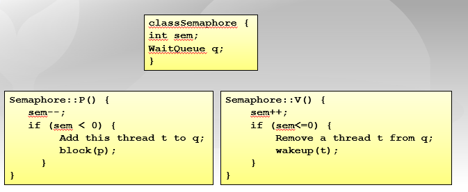
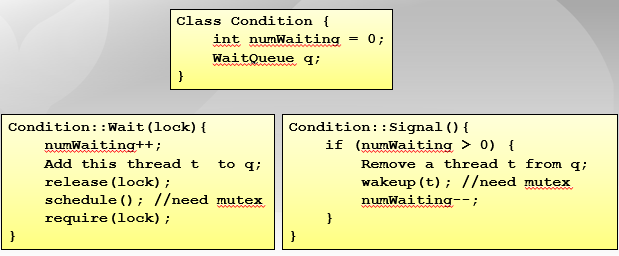
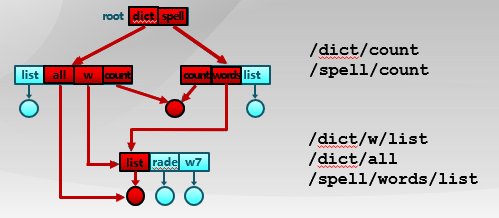

# 操作系统 8-14

# Week 8

## 信号量与管理

### what is semaphore? 信号量	

variable or abstract data type used to control access to a common resource by multiple process and avoid critical section problems in a concurrent system such as multitasking operating system, denoted as S or Sem

- software synchronization is a synchroniation negotiation mechanism between equal threads

- operating system is the manager, higher status than process

equiped with two atomic operations, denoted as P and V,

```
S - represents the number of units of resources that are availible
P - decrements S, wastes time or sleeps until a resources protected by semaphore becomes availible
V - icrements S, makes resources available after the process has finished using it.
```



### what is monitor?

a program structured used for multi-threaded mutual exclusive access to shared resources, a synchronization constructed created to overcome the problems caused by semaphores such as timing errors. 

- abstract data type, shared data variables and procedures
- at any moment, only one thread can be running monitor, the thread at any moment can temporarily abandon exclusive access of monitor and wait for the event to resume

- shared data variables cannot be directly accessed by a process and procedures are required to allow a single process to access the shared data variables at a time.

one lock + 0 or more conditional variables - the waiting mechanism in the monitor

```
wait() block istelf and add to queue, wake up WAIT or release locked 
signal() wake up from queue, if queue is empty, no operation
```



### hoare vs hansen monitor?

### mutex vs monitor vs semaphore?ba

mutex is synonymus to lock

monitor is a super structure over mutex,  use mutex status of thread/object control access to shared resources

- A monitor consists of a [mutex (lock)](https://en.wikipedia.org/wiki/Lock_(computer_science)) object and **condition variables**. A **condition variable** essentially is a container of threads that are waiting for a certain condition. Monitors provide a mechanism for threads to temporarily give up exclusive access in order to wait for some condition to be met, before regaining exclusive access and resuming their task. Also have process that signaling other threads that their condition has been met.

semaphore used a counter, can allow multiple threads to run at the same time (mutex is just semaphore of count 1)

# Week 9

## 死锁和并发错误检测

### what is deadlock?

when two or more processes need some resource to complete their execution that is held by the other process 

- deadlock detection
- deadlock prevention
- deadlock avoidance

### four Coffman conditions?

deadlock occurs if the four Coffman conditions hold true, but these conditions are not mutually exclusive

1. mutual exclusion - there should be a recourse that can only be held by one process at a time
2. a process holding multiple resources and still request more resources from other processes which are holding them
3. no preemption - resources cannot be preempted from a process by force, process can only release a resource voluntarily
4. circular wait - Process is waiting for the resource held by the second process, which is waiting for the resource held by the third process and so on, till the last process is waiting for a resource held by the first process. 

### what is Banker's Algorithm

```c++
// n process, m resources types
auto Available = new array[m];
// Available[j] = k, k instances of resource type Rj
auto Max = new array[n][m];
// Max[i][j] = k, process Pi request at most k instances of resource type Rj
auto Allocation = new array[n][m];
// Allocation[i][j] = k, process Pi is currently allocated k instances of resource type Rj
auto Need = new array[n][m];
// Need[i][j] = Max[i][j] - Allocation[i][j], indicates remaining resource needed to complete task
```

consists of two algorithms

1. Safety Algorithm - determine whether or not a system is in safe state, four steps

   1. initialize, no process has finished and number of resources available 

   ```c++
   auto Work = Available 												
   auto Finish[i] = false for i = 0, 1, ..., n - 1
   ```

   2. find i, such that both

   ```c++
   Finish[i] == false
   Need[i] <= Work
   ```

   find unfinished process whose needs can be satisfied, if no process exists, skip to step 4

   3. perform

   ```c++
   Work = Work + Allocation[i];
   Finish[i] = true
   ```

   when unfinished process is found, allocated resources, and when that is fenished, loop is repeated to check for other processes

    	4. finished, system is safe

   ```c++
   Finish[i] == true for all i
   ```

2. Resource Request Algorithm - used to determine whether requests can be safety granted or not, three steps

   ```c++
   auto Requesti = new array[]; // request vector for process pi
   // Requesti[j] = k, process Pi wants K instances of resource type Rj
   ```

   1.  ```c++
       if Requesti <= Need[i]// go to step 2
       else // raise error, since process has exceeded maximum claim
       ```

   2. ```c++
      if Requesti <= Available[i] // go to step 3
      else // Pi must wait since resource not available
      ```

   3.  ```c++
       Available = Availale - Requesti
       Allocation[i] = Allocation[i] + Requesti
       Need[i] = Need[i] - Requesti    
       ```

   If the resulting resource allocation comes out safe, then the transaction is completed, and the process Pi is allocated its resources. But if the new state is unsafe, then Pi waits for Requesti, and the old resource-allocation state is restored

disadvantages

1. process can't change its maximum need, process must know in advance about maximum resource needs,


### what is deadlock detection?

allow system to enter a deadlock state, maintenance system resource allocation diagram, periodically call the deadlock detection algorithm to search for deadlocks, use deadlock recover mechanism to recover

### what is deadlock recovery?

terminate all deadlock processes one at a time until deadlock is eliminated, termination based on different factors

## 进程通道

### what is inter-process communication IPC? 

message queue maintained by the operating system is is used to realize the message receiving and sending between processes

characteristics

1. each messaging queue has a unique identifier
2. only processes with shared message queues can establish connection/communicate that can be uni/bi-directional

### what is blocking vs non-blocking inter-process communication?

blocking  send is when sender enters WAIT until message is received

blocking receive is when receiver receives connection request until message is received

non-blocking send is when sender continues operations immediately after message is sent

non-blocking receive is when receiving doesn't have to wait for the message to be totally received to continue operations

3 buffering modes (缓冲)

- 0 (sender has to wait until receiver accepts), limited, unlimited

### what is a signal?

software interrupt notification and handling mechanism between processes

### what is pipe 管道? 

pipe is one way communication between two processes. the process that creates the pipe (as well as its child) can write to the pipe, and another process can read from the pipe. The peipe is an area of the main memory trated as a virtual file. 

### what is dbus?

mechanism that allows communication between multiple processes running concurrently on the same machine. used to standardize services provided by Linux Desktop environments

### what is binder?


# Week 10

## 文件系统

### what is a file system?

subsystem that manages persistent data in operating system, providing data storage and access functions

functionality: 

1. manage file blocks (location and order)
2. manage free space (location)
3. allocation algorithm

management: positioning, name, structure

reliability and safety:  multilevel protection, save files for persistently in face of crashes, errors, and attacks

operating system uses open file table to track file information

- pointer to file, number of times opened, location on disk, access permission

### user view vs system view of files?

- user view has persistent data structure
- system access interface - collection of byte sequences, does not care about data structure
- operating system file view - collection of data blocks, data block is logical storage unit, sector is physical storage unit

reading file - get the data block where the byte is located and return corresponding part in the data block

writing file - get data block, edit the data block, write back data block

### 

### how does processes access files?

1. sequentially
2. random
3. search

### how to realize a file system?

linear, with pointers to data blocks

hash table, decreases search systems, conflict (same hash value), set size

### what is inode?

**inode**, an inode is a data structure comprised of metadata about the file such as file creation date, file authorizations, owner of the file and more.

### hard link vs soft link?

hard link is the direct reference (by multiple items) to the file

soft link (similar to shortcut on windows) is the reference by name which means it points to a file by file's logical name



### how to prevent file system loops？

only allow links to files, links to subdirectories are not allowed, use loop detection algorithm, limit the number of file directories that can be traversed

### what is mounting 挂载?

process by which operating system makes files and directories on storage device available for users to access. it includes acquiring access to storage medium, recognizing, reading, and processing file system structure and metadata on it before registering them to the virtual file system.

### how to manage free space?

bitmaps, 1 represent data block already allocated, 0 means its empty

- simple, but might result in a huge vector table

other methods include linked list (each empty space links to next empty space), and link index table (links to all empty space)

### what is virtual file system? 

it allows client applications to access different types of concrete file systems in a uniform way.  allows applications to access files on local files system of different types without the application having to know what type of file system they are using 

four primary objects - 

1. superblock (specific mounted file system), 
2. inode (specific file and operations needed to to manipulate), 
3. dentry (directory, single component of path name), 
4. file (open file as associated with a process)

### what is profcs?

it presents information about processes and other system information

- provide a more convenient and standardized method for dynamically accessing processed data held in the kernel
- the proc file system acts as interface to internal data structures in kernel, and provides a method of communication between kernel space and user space.

## 文件系统实例

System Reliability 

- High Availability - ensure an agreed level of operational performance for a longer period of time
- Fault Tolerant - ability to keep operating properly in the face of one or more faults in components
- Disaster Recovery 

### FAT vs EXT4 vs ZFS file system?

# Week 11

## I/0字系统

### what is I/0 subsystem?

These devices are not connected directly to the CPU. Instead, there is an interface that handles the data transfers. This interface converts the system bus signals to and from a format that is acceptable to the given device. The CPU communicates to these external devices via I/O registers

# Week 12

## 分布式系统

### what is a distributed system?

independent components located on different machines that can communicate with each other

### what is a distributed file system?

any file system that allows access to files from multiple hosts sharing via a computer network

## 操作系统发展趋势


