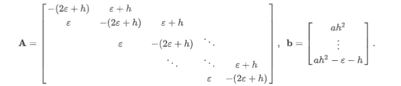

# 数值分析 lab4

## 第4章上机题2：

考虑长微分方程的两点边值问题
$$

$$
它的精确解为
$$
 
$$
为了把微分方程离散，把$[0,1]$区间n等分，令$h=\frac{1}{n}$
$$
x_i = ih, (i = 1,2, \dots,n-1)
$$
得到有限差分方程
$$
\epsilon\frac{y_{i-1}-2y_i+y_{i+1}}{h^2} +\frac{y_{i+1}-y_i}{h}=a,
$$
简化为
$$
{(\epsilon+h)y_{i+1}-(2\epsilon+h)y_i+\epsilon y_{i-1}=ah^2}
$$
从而离散后得到的线性方程组的系数矩阵与右端向量为

题目

1. 对$\epsilon=1, a=\frac{1}{2}, n=100$，分别用雅可比，G-S和SOR方法求线性方程组的解，要求响铃迭代解的差的无穷范数不超过$10^{-3}$然后比较与精确解的误差
2. 对$\epsilon = 0.1, \epsilon= 0.01, \epsilon = 0.0001$考虑同样的问题

