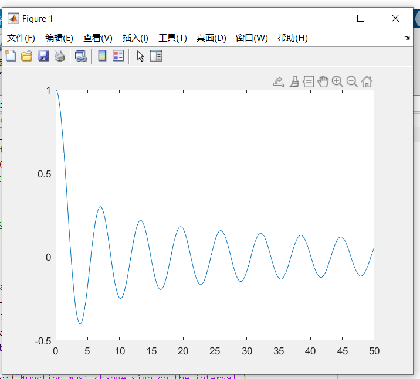

# 数值分析 lab2

计83李天勤2018080106

## 第2章上机题2

编程实现牛顿下山法，要求

1. 设定合适的下山因子初始值$\lambda_0$ 及迭代判停准则
2. 下山因子$\lambda$用逐次折半法更新
3. 打印每个迭代步的最终$\lambda$值及近似
4. 请用其他方法（如fzero函数）验证结果，并考虑采用牛顿下山法的效果，

用所编程序求解：

1. $x^3-x-1=0$，取$x_0=0.6$
2. $-x^3+5x=0$，取$x_0=1.35$


### 实验实现

牛顿法
$$
x_{k+1} = x_k - \frac{f(x_k)}{f'(x_k)}, k = 0,1,2, \dots,
$$
下山法
$$
x_{k+1} = x_k - \lambda_i \frac{f(x_k)}{f'(x_k)}
$$
 $\lambda_i$ represents 阻尼因子

```matlab
disp("equation 1: ");
% initial value
x_0 = 0.6;
x_k = x_0;
% error
epsilon = 1e-5; 
lambda_0 = 1;
% step one
x_k_plus_one = x_k - lambda_0 * f1(x_k) / df1(x_k);
% realization
while abs(f1(x_k)) > epsilon || abs(x_k_plus_one - x_k) > epsilon
    step = f1(x_k) / df1(x_k);
    x_k_plus_one = x_k - step;
    lambda = lambda_0;
    % 阻尼下山法
    while double(abs(f1(x_k_plus_one))) >= double(abs(f1(x_k)))
        x_k_plus_one = x_k - lambda * step;
        lambda = lambda / 2;
    end
    x_k = x_k_plus_one;
    disp(["lambda:" num2str(lambda) "x:" num2str(x_k_plus_one)]);
end

disp(x_k_plus_one);
% use fzero to caclulate actual root
sol = fzero(@f1, x_0);
disp("fzero:");
disp(sol);

% declare functions
function f1 = f1(x)
    f1 = x^3 - x - 1;
end
% declare first derivative
function df1 = df1(x)
    df1 = 3 * x^2 - 1;
end
```

Here, I set $\lambda_0 = 1.0$ , and the error value to be $10^{-5}$.

### 实验结果

```matlab
>> lab2_2
equation 1: 
    "lambda:"    "0.015625"    "x:"    "1.1406"
    "lambda:"    "1"    "x:"    "1.3668"
    "lambda:"    "1"    "x:"    "1.3263"
    "lambda:"    "1"    "x:"    "1.3247"
    1.3247
fzero:
    1.3247
    
equation 2:
	"lambda:" "0.0625" "x:" "2.497"
	"lambda:" "1" "x:" "2.272"
	"lambda:" "1" "x:" "2.2369"
	"lambda:" "1" "x:" "2.2361"
	2.2361
fzero:
	2.2361   
 
```

If we just use the regular Newton's Method, we get

```matlab
equation 1: 
    "lambda:"    "1"    "x:"    "17.9"
    "lambda:"    "1"    "x:"    "11.9468"
    "lambda:"    "1"    "x:"    "7.9855"
    "lambda:"    "1"    "x:"    "5.3569"
    "lambda:"    "1"    "x:"    "3.625"
    "lambda:"    "1"    "x:"    "2.5056"
    "lambda:"    "1"    "x:"    "1.8201"
    "lambda:"    "1"    "x:"    "1.461"
    "lambda:"    "1"    "x:"    "1.3393"
    "lambda:"    "1"    "x:"    "1.3249"
    "lambda:"    "1"    "x:"    "1.3247"
    1.3247
fzero:
    1.3247
```

Although this gets us the right answer, 下山法 greatly increases the convergence rate, allowing us to get within the error range much quicker. Both results are checked with matlab's ```fzero``` function.

## 第2章上机题3

利用2.6.3节给出的```fzerotx```程序，在MATLAB中编程求第一类的零阶贝塞尔函数$J_0(x)$的零点，$J_0(x)$在MATLAB中通过```besselj(0,x)```得到。试求$J_0(x)$的前10个正的零点，并绘出函数曲线和零点的位置。

### 实验实现

Given the code for ```ftzero``` in the book, we simply had to use the function properly to complete this lab.

```matlab
% domain 0 to 50, interval of .1
x = 0:0.1:50;
% 零阶贝塞尔函数
y = besselj(0, x);
ab = [0 5];
% ftzero (函数, 初始有根区间, 额外参数)
b = fzerotx(@besselj, ab, 0);
plot(x, y);
```

### 实验结果

