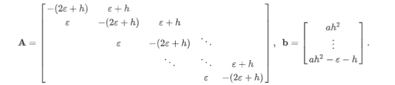

# 数值分析 lab4

计83李天勤2018080106

## 第4章上机题2：

## 实验要求

考虑长微分方程的两点边值问题
$$
\left\{\begin{array}{l}\varepsilon \frac{\mathrm{d}^{2} y}{\mathrm{d} x^{2}}+\frac{\mathrm{d} y}{\mathrm{d} x}=a,(0<a<1) \\ y(0)=0, y(1)=1\end{array}\right.
$$
它的精确解为
$$
y=\frac{1-a}{1-e^{-1 / \varepsilon}}\left(1-e^{-\frac{x}{\varepsilon}}\right)+a x
$$
为了把微分方程离散，把$[0,1]$区间n等分，令$h=\frac{1}{n}$
$$
x_i = ih, (i = 1,2, \dots,n-1)
$$
得到有限差分方程
$$
\epsilon\frac{y_{i-1}-2y_i+y_{i+1}}{h^2} +\frac{y_{i+1}-y_i}{h}=a,
$$
简化为
$$
{(\epsilon+h)y_{i+1}-(2\epsilon+h)y_i+\epsilon y_{i-1}=ah^2}
$$
从而离散后得到的线性方程组的系数矩阵与右端向量为



题目

1. 对$\epsilon=1, a=\frac{1}{2}, n=100$，分别用雅可比，G-S和SOR方法求线性方程组的解，要求相邻迭代解的差的无穷范数不超过$10^{-3}$然后比较与精确解的误差
2. 对$\epsilon = 0.1, \epsilon= 0.01, \epsilon = 0.0001$考虑同样的问题

## 实验实现

First, we need to realize the three algorithms, Jacobi, G-S and SOR

Defined in jacobi.m,

```matlab
% jacobi.m
function [x, n] = jacobi(A, b, x0, eps) % matrix A, vector b, initial x0, error eps 
    % A = D - L - U
    D = diag(diag(A));                  % diagonal matrix D
    L = -tril(A, -1);                   % lower triangle L
    U = -triu(A, 1);                    % upper triangle U
    B = D \ (L + U);                    % 常矩阵   
    f = D \ b;                          % 常向量
    x = B * x0 + f;                     % 固定格式迭代法
    n = 1;                              % step
    while norm(x - x0, inf) >= eps      % 不满足收敛条件时 
        x0 = x;
        x = B * x0 + f;
        n = n + 1;
    end
end


```

Defined in gs.m

```matlab
% gs.m
function [x, n] = gs(A, b, x0, eps) % matrix A, vector b, initial x0, error eps 
    % A = D - L - U
    D = diag(diag(A));              % diagonal matrix D
    L = -tril(A, -1);               % lower triangle L
    U = -triu(A, 1);                % upper triangle U
    B = (D - L) \ U;                % 常矩阵
    f = (D - L) \ b;                % 常向量  
    x = B * x0 + f;                 % 固定格式迭代法
    n = 1;                          % step
    while norm(x - x0, inf) >= eps  % 不满足收敛条件时
        x0 = x;
        x = B * x0 + f;
        n = n + 1;
    end
end
```

Defined in sor.m

```matlab
% sor.m 
function [x, n] = sor(A, b, x0, omega,eps)  % matrix A, vector b, initial x0, 松弛因子，error eps 
    % A = D - L - U
    D = diag(diag(A));                                  % diagonal matrix D
    L = -tril(A, -1);                                   % lower triangle L 
    U = -triu(A, 1);                                    % upper triangle U
    B = (D/omega - L) \ ((1.0/omega - 1) * D + U);      % 常矩阵   
    f = (D/omega - L) \ b;                              % 常向量
    x = B * x0 + f;                                     % 固定格式迭代法
    n = 1;                                              % step    
    while norm(x - x0, inf) >= eps                      % 不满足收敛条件时
        x0 = x;
        x = B * x0 + f;
        n = n + 1;
end
```

Then, in lab4_2, we call these functions

```matlab
% lab4_2.m
eps = 1.0;          % eps 1, 0.1, 0.01, 0.0001
a = 0.5;            % a = 1/2
n = 100;            % n = 100
h = 1.0 / 100;      % h = 1 / n

% set up A and b
x = (1:1:n) * h;                        % x_i = ih, (i = 1,2, ...,n-1)
v = ones(n, 1) * (-2 * eps - h);        % n x 1 vector * (-2 * eps - h)
v(1) = 2 * eps + h;                     
A = diag(v) + diag(ones(n - 1, 1) * eps, -1) + diag(ones(n - 1, 1) * (eps + h), 1);
b = ones(n, 1) * (a * h * h);
b(n) = b(n) - eps - h;                  % vector b

% 迭代法
[sol_jacobi, n_jacobi] = jacobi(A, b, zeros(n, 1), 0.001);
[sol_GS, n_GS] = gs(A, b, zeros(n, 1), 0.001);
[sol_SOR, n_SOR] = sor(A, b, zeros(n, 1), 0.9, 0.001);

% 范数 
norm_jacobi = ["norm_jacobi", norm(x - sol_jacobi, 2),"in", n_jacobi, "steps"];
disp(norm_jacobi);
norm_gs = ["norm_gs", norm(x - sol_GS, 2), "in", n_GS, "steps"];
disp(norm_gs);
norm_sor = ["norm_sor", norm(x - sol_SOR,2) "in", n_SOR, "steps"];
disp(norm_sor);

```

## 实验结果

$\epsilon = 1$

```matlab
>> lab4_2
"norm_jacobi"    "48.6605"    "in"    "533"    "steps"

"norm_gs"    "48.935"    "in"    "274"    "steps"

"norm_sor"    "49.9243"    "in"    "272"    "steps"

```

$\epsilon = 0.1$

```matlab
>> lab4_2
"norm_jacobi"    "32.2621"    "in"    "1355"    "steps"

"norm_gs"    "34.2868"    "in"    "645"    "steps"

"norm_sor"    "40.5459"    "in"    "596"    "steps"
```

$\epsilon = 0.01$

```matlab
>> lab4_2
"norm_jacobi"    "38.7403"    "in"    "405"    "steps"

"norm_gs"    "38.7521"    "in"    "251"    "steps"

"norm_sor"    "38.7366"    "in"    "293"    "steps"
```

$\epsilon = 0.0001$

 ```matlab
>> lab4_2
"norm_jacobi"    "39.189"    "in"    "111"    "steps"

"norm_gs"    "39.1897"    "in"    "106"    "steps"

"norm_sor"    "39.1884"    "in"    "125"    "steps"

 ```

## 实验分析

When $\epsilon  = 1, 0.1, 0.01$, the jacobi algorithm takes considerably longer for it to converge compared to the other GS and SOR.  We can also see that as $\epsilon$ increases, the error becomes more uniform, and the number of steps it takes to complete each algorithm becomes more similar.

