# 数据结构 - 笔记

主要考试内容

- 数据结构概念，逻辑结构与存储结构，抽象数据类型，算法定义与特性 $\checkmark$
- 算法分析，线性表，循环表，单链表，循环链表，双向链表 $\checkmark$
- 栈的定义与实现，顺序栈与链式栈，栈的递归，回溯法 $\checkmark$
- 队列与实现，循环队列与链式队列，双端队列，受限的双端队列，特殊矩阵的压缩存储  $\checkmark$
- 字符串的模匹配，kmp算法 $\checkmark$
- 二叉树的定义，表示与性质，二叉树遍历，递归与非递归算法 $\checkmark$
- 树与树林的概念，堆的概念与实现 $\checkmark$
- Huffman树与应用 $\checkmark$
- 静态搜索结构，顺序与折半搜索，$\checkmark$
- 二叉搜索树的插入删除 $\checkmark$
- AVL树的概念与平衡化，$\checkmark$
- 散列表与散列函数，处理冲突的方法，散列表分析 $\checkmark$
- 图的概念与存储表示，图的遍历与连通性 $\checkmark$
- 最小生成树，最短路径 $\c$

## 一，数据结构的概念，算法

algorithm 是一个有穷规则的集合，这些规则的解决某一特定类型的问题规定了一个运算序列

- 有5个特性：输入，输出，有穷性，确定性，能行性

算法中常用的经典方法

- 递推法，递归法，穷举法 （exhaustive method），贪心算法（greedy method），分治法（divide and conquer），动态规划法（dynamic），迭代法（iteration），分支界限法（branch），回溯法 （backtracking）

- 递推vs递归？

  - 递推，iterative method
  - 递归，recursive method

  ```c++
  //递归求解
  function fib(n){
      return n < 2 ? 1 : fib(n-1) + fib(n-2);
  }
  //递推求解
  function fib(n){
      let start=0;
      let fn=1;
      for (let i=0;i<n;i++) {
          let t=fn;
          fn=fn+start;
          start=t;
      }
      return fn;
  }
  ```

- 算法性能指标与评价标准：正确性效率，可读性，鲁棒性（robustness）

时间复杂性$T(n)$和空间复杂性$S(n)$

- Big-O Notation, $\Omega, \Theta$

排序：选择排序，交换排序，冒泡排序

```c++
void bubbleSort(int arr[], int n) {
    for (int i = 0; i < n - 1; i++) {
        for (int j = 0; j < n - i - 1; j++) {
            if (arr[j] > arr[j + 1]) swap(&arr[j], &arr[j+1]);
        }
    }
}
```

## 二，线性表


1. 线性表 （linear  list）default linked list and linear data structure in which data is not stored in contiguous (memory blocks having consecutive addresses）memory location but each data node is connected to the next data node via a pointer

   1. 特点，直接前驱与直接后驱 （direct precursor and direct successor）

2. 顺序表 （sequential list）sequential store elements in contiguous memory location, such as an array

   1. inserting to list shifts all elements after it to the right (in terms of memory)
   2. deleting a element in list shifts all elements after it to the left (in terms of memory)
   3. pros  - high storage utilization, fast random access speeds
   4. cons - low efficiency during insertion and deletion, difficult to determine appropriate storage speed when dealing with dynamic changes

3. 单链表 （singly linked list）

4. 循环表 (circular queue) sequential representation/realization of queue, appears to solve the problem of false overflow

   ​	1. the key difference between 循环链表  is  explained well here, https://stackoverflow.com/questions/11867362/circular-queue-and-circular-linked-list#:~:text=%20The%20major%20difference%20between%20circular%20linked%20list,the%20end%2Ftail.%20In%20case%20of%20Circular...%20More%20

5. 循环链表  (circular linked list),

   1. the key difference between 单链表 is that when it reaches the end, it reach the head node, not NULL

6. 多向链表 （doubly linked list）

7. 静态链表 （static linked list) pointer to each element in the array to form, physical location of each element can be changed during processing, and the logical order of these elements can be changed by relinking

   1. faster access to elements
   2. use when don't need dynamic size

   

   - arr[0] represents head node,  points to location given by link (3), which points to a3 (arr[link = 3])
   - 如果是循环链表，last node has link=0, pointing to head, if not, it has link=-1

抽象类与抽象基类 abstract class and abstract base class, used not to define an object but as a basic type for inheritance, contain pure virtual functions, provide a common interface for the class family. 

搜索性能分析

搜索成功平均比较次数 ACN （average comparison number）
$$
\text{ACN} = \sum^N_{i=1}{p_i \times c_i}
$$
$p_i$ probability for searching for the $i$th element, $c_i$ is the number of comparisons when found

- for linear search (probability of search is equal), $\text{ACN}_{succ}= (n+1)/2,$ $\text{ACN}_{fail} = n$

平均移动元素个数 AMN （average move number）

- for deletion in sequential  $\text{AMN} = \frac{1}{n} \sum^n_{i=1}(n-1) = \frac{n-1}{2}$

## 三，栈与队列


### 栈的概念

stack - linear table with insertions and deletions at one end of the table （the end that allows insertion and deletion is called the top of the stack, and the other end is called the bottom of stack）, considered LIFO structure

1. 顺序栈 （sequential stack）

   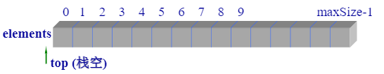

2. 双栈  （double stack） two stacks in one array, each stack will grow in opposite directions, one from lower index to higher index and the second one from higher to lower index.

   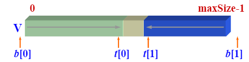

   lower index stack initial, b[0] = t[0] = -1

   higher index static initial, t[1] = b[1] = maxSize

3. 链接栈 (linked stack)

   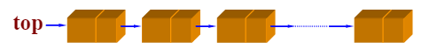

出站序列Catalan数，进站元素编号为$1,2,\dots,n$, 可能得出栈序列有多少种？
$$
\text{C}_n = \frac{(2n)!}{(n+1)!n!} = \frac{1}{n+1}C(2n,n) = \frac{1}{n+1}\frac{(2n)!}{n!(2n-n)!}
$$

### 栈的应用

表达式求值 （expression）中缀 infix A+B，前缀 prefix +AB，后缀 postfix AB+

### 递归与非递归

递归，Tower of Hanoi

- 时间复杂度 $O(n)=2^n-1=2^n$
- 空间复杂度$T(n)=2^n$

递归 -> 非递归过程， in recursive functions, although the program is concise, there are many repeated calls and low efficiency.

递归、非递归，queens game

### 队列的概念

queue, insertion at one end, deletions at another end (insertion at the rear, deletion at the front), known as a FIFO  structure

实现方法

1. 顺序队列

   use head pointer to point to front of stack

   

   after popping the first two elements, the head element is moved up two space to point at new head of stack

   

   but after enough iterations of push/pop, we can see that we will run out of room (head and tail both move right). We can fix this problem by shifting the elements once tail reaches the end, as such

   

   a further optimization is known as circular queue, in which the tail, once reaching the end of the memory space, wraps around to the front (0), and starts using up the free space there. It can be visualized as such, 

   

   if elements a, b, c, and d enter the stack, then the new updated value is as such, 

   

2. 链式队列


优先级队列 （priority queue），queue in which the items are measured by key value so that items with the lowest key value are at the front and the items with the highest key value are at the end

- every time we dequeue, the item with the highest priority (or lowest key value)

双端队列 （deque，double-ended dequeue）, can dequeue, enqueue from both ends of queue

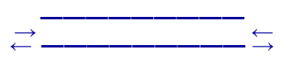

- 输入受限的双端队列 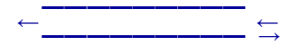不能得到4213、4231
- 输出受限的双端队列 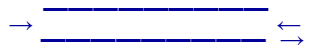不能得到4132、4231

### 队列的应用

杨辉三角形，Pascal's Triangle


purple - 0 + 1 = 1, 1 + 2 = 3, 2 + 1 = 3, 1 + 0 = 1, result = 1, 3, 3, 1

blue  - 0 + 1 = 1, 1 + 3 = 4, etc...

迷宫 Maze

## 四，数组，串与广义表

### 数组的概念 

数组，collection of data elements of the same type

- statically vs dynamically defined arrays (new and delete)
- 1D vs 2D
- 行优先存放 (i * n + j) vs 列优先存放 (j * n + i)

### 特俗矩阵的压缩存储 compression of special matrices


- 对称矩阵 (lower triangle)

  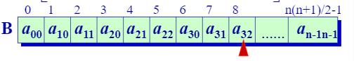

  In order to access element $A[i][j]$ in $B$, where $i \geq j$, $(i+1)*i/2 + j$

  Although values in the upper half aren't technically stored, you can't find the symmetric elements through $A[j][i], j*(j+1)/2 + i$

- 对称矩阵 （upper triangle)

  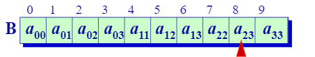

  In order to access element $A[i][j]$ in B, where $i \leq j, (2*n - i - 1) * i/ 2 + j$

  To find the corresponding upper half, simply switch the $i$ and $j$'s 

- 三对角矩阵

  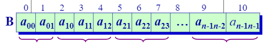

  To access each element $A[i][j], 2*i +j$

### 稀疏矩阵 （sparse matrix）和转置 (transpose)

when s (non-zero elements) $\leq$ 0.5 * m (rows) * n (cols), e = s / (m * n)

| original matrix                                              | transpose                                                    |
| ------------------------------------------------------------ | ------------------------------------------------------------ |
| 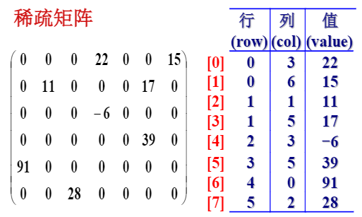 | 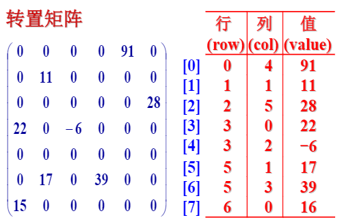 |

naïve algorithm, switch values of row/col, make row in sequential order, depending on sort, lets say selection, will take about $O(n*t)$  or if $t$ is close to $m*n$, then it might take $O(m* n^2)$ time. 

we can simplify this even more, 

| 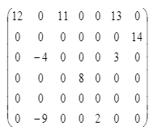 | 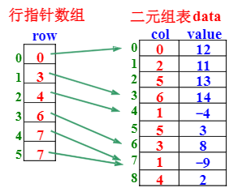 |
| ------------------------------------------------------------ | ------------------------------------------------------------ |

faster algorithm time complexity is $O()$

### 字符串 strings

is a bounded sequence of characters

- 串常量（constants） vs 串变量（variable）
- strcpy, strcat

### 串的模式匹配 （string pattern matching）

T - target （长度n）, P - pattern （长度m）

朴素的模式匹配 Brute-Force Algorithm


算法复杂度$O(n*m)$

```c++
int brute_force(String Target, String Pattern) {
	int M = Target.length;
	int N = Pattern.length;
	
	for(int i = 0; i < M - N; i++) {
        int j;
		for(j = 0; j < N; j++) {
            if( Pattern[j] != Target[j]) break;
            if (j == N)
        }
        if (j == N) return i; // all matching
	}
    
    return - 1; // no matches
}
```

### KMP 算法

longest proper prefix which is also suffix, often denoted as lps

proper prefix is a prefix that is not equal to string itself, for example, in string ABC, a proper prefix would be A or AB, but not ABC

so the longest proper prefix for the"aabaaab" is is "aab", the longest proper prefix which is also suffix

Steps

1. We need to define a prefix function for the longest proper prefix's of the (pattern's) substrings $s[0\dots i]$, which is also a suffix. The prefix function can be denoted by $\pi[i]$ where $\pi[0]=0$ by definition, this can be mathematically derived by
   $$
   \pi[i] = \max_{k=0\dots i} \{k:s[0\dots k - 1] = s[i-(k-1)\dots i]\}
   $$
   The suffix represented by $S[0\dots k-1]$, and the prefix represented by $S[i-(k-1), i]$ , both of length $k-1.$ Thus $\pi[i]$ gives us the length of the lps in the substring $s[0\dots i]$. The two substrings cannot overlap.

   For example, the string "aabaaab" has a prefix function of $[0,1,0,1,2,2,3]$

https://www.geeksforgeeks.org/kmp-algorithm-for-pattern-searching/

https://cp-algorithms.com/string/prefix-function.html

算法复杂度$O(n+m)$

## 五，树与二叉树

### 树和树林的概念

tree is a data structure made up of nodes/vertices and edges without having any cycle

- elements called nodes, one of them the root

- a tree is considered a non-directional graph, with $n-1$ edges, connected, and has no loops

- 自由树 (free tree with non defined root) vs  有根树  (defined root, notion of depth)

  https://math.stackexchange.com/questions/214801/what-is-the-main-difference-between-a-free-tree-and-a-rooted-tree

  roots of the subtrees of 有根树 only have one direct precursor, but can have many successor (直接后续)

- 有序树 （ordered tree）， if subtrees of each node in the tree are regarded as ordered from left to right

- notion of depth, height, hierarchy

### 二叉树 (binary tree)

- the ith level has at most $2^{i -1}$ nodes

- binary tree with depth level k has at most $2^k -  1$ nodes

- non-leaf nodes with degree 2, n2, leaf nodes n0, $n0 = n2+1$

满二叉树 （full binary tree）, also known as a proper or plane binary tree, in which every node in the tree has either 0 or 2 children, depth of k has $2^k-1$ nodes

完全二叉树 （complete binary tree）, in a tree with depth k, the number of nodes in levels 1 to k - 1 have reached the maximum, and on the kth level, tree is filled from furthest left, moving right


​	完全二叉树 with n nodes has a depth of $\lceil \log_2{(n + 1)}\rceil$， 双亲 (parent node)  

正则二叉树vs理想平衡二叉树

二叉树的表示

- 顺序表示
- 链表表示
- 三叉链表静态结构

### 二叉树遍历 （binary tree traversal）

The traversal of the binary tree is to visit the nodes in the tree in a certain order, requiring each node to be visited once and only once, three methods are  (root V, left subtree L, right subtree R)

- 前序 VLR preorder traversal
- 中序 LVR inorder traversal
- 后续 LRV postorder traversal

preorder does not determine uniqueness of tree

combination of preorder + inorder can determine uniqueness of tree


how many distinct binary trees with n unlabeled nodes? Catalan number 

number of distinct binary trees possible with n labeled nodes $(2n)!(n+1)!$ 

number of distinct binary search trees possible with n nodes?  $(2n)!(n+1)!$ 

### 遍历算法

from recursive to iterative

### 树与森林 (tree and forests)

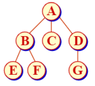

存储方式

1. 广义表表示

   

2. 双亲表示

   

3. 子女链表表示

   

4. 子女指针表示

   

5. 子女-兄弟表示

   

   

深度优先遍历？depth first search

- 先根次序遍历 (深度优先) same as 前序遍历
- 后根次序遍历 same as 中序遍历

Turning a general tree into a binary tree representation is to use the子女-兄弟表示 of the tree to store the structure of the tree.

The conversion between the forest and the binary tree representation can be achieved with the help of the binary tree representation of the tree.

树林的，深度优先遍历 vs 广度优先遍历

### 堆 (heap)

is a 完全二叉树

- 最大栈（max heap），父节点的值不小于两个字点的值， vice versa for 最小栈（min heap)


- often used to manage information during the execution of an algorithms, include heap sorting, priority queues, etc.
- 堆 is a maximally efficient implementation of 优先级队列, in heap, highest (or lowest) priority element is always stored at root stored at root.

implementation of min heap, can use array and tree properties to implement insertion/deletion

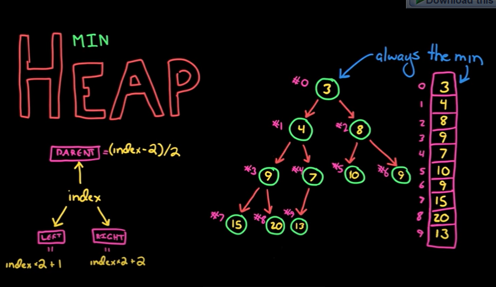

insertion, add into next open space, then compare upwards, swapping with parent if necessary 

- in the case of min heap, if next added number is smaller, swap with parent if it is smaller, until no more swaps

deletion, remove root, replace root with most recently added node (last array value), and compare downwards

- in case of min heap, if the replacement (last array value) is bigger then its children, swap with its children

creating a minheap from array of integers

```c++
currentSize= n;//复制堆数组和长度
int currentPos= (currentSize-2)/2;//找最初调整位置:最后分支结点,参考堆元素下标计算
while (currentPos>= 0){//逐步向上扩大堆
    siftDown(currentPos, currentSize-1);//局部自上向下下滑调整
    currentPos--;     //修改分支结点位置
}

```

下滑调整算法 comparing downward and shifting larger elements downward

上滑调整算法, comparing upward and shifting smaller elements upward

 Time complexity $O(N\log{N})$ (In reality, building a heap takes O(n) time depending on the implementation)

### Huffman树

Create a set of symbols and corresponding weights (usually proportional to the probability of each symbol)

- solve a set of binary prefix code schemes for this group of symbols, so that the expected length of the codeword after encoding is the shortest 
- Prefix code: In the coding scheme, the code of one symbol cannot be the prefix of any other code (what's the use?)

Purpose: Lossless data compression

概念

1. 路径与路径长度

   1. 外部路径长度 EPL sum of the paths from leaf nodes to root
   2. 内部路径长度 IPL sum of the paths  from non-leaf nodes to root
   3. 路径长度 PL = EPL + IPL, $PL \geq \sum^n_{i=1}{\lfloor \log_2i \rfloor}$, 完全二叉树 has the lowest PL, but not necessarily the only one with lowest PL

2. 带权路径长度（weighted path length）

   1. $\text{WPL} = \sum^N_{i = 1} w^i  * l_i$

      

A tree with the smallest 带权路径长度 is known as Huffman tree, in a Huffman tree, the biggest values are located more closely to the root node

https://www.youtube.com/watch?v=dM6us854Jk0

implementation using array


time complexity is $O(n\log{n})$, $\log{n}$ to find the cheapest weight, and insert

## 七， 搜索结构

### 查找的概念

find data objects that meet certain conditions 
$$
\text{ASL}_{succ} = \sum^n_{i=1}{p[i] * c[i]}
$$

- n number of objects

- pi represents probability of finding the ith item
- ci represents number of comparisons to find ith item
- lower the ASL, more efficient the algorithm

### 静态查找表

once the search structure is established, it will not change

- 顺序查找 （sequential search）

  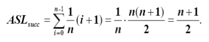

  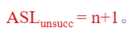

- 二分查找 （binary search）

  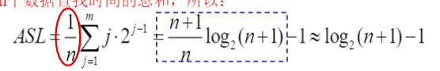

- 分块查找 

### 动态而查表

the search structure may change due to insertion or deletion

- 二叉搜索树（binary tree search）

  - all keys are different 
  - keys in left subtree are all smaller, keys in right subtree are bigger, subtrees are also binary tree search
  - process of comparing and judging from the root node and going down a certain branch layer by layer
    - if less then key, go left, if more than key, go right
    - number of comparisons does not surpass height of tree
    - 复杂度$O(n)=\log_2n$,  between 顺序查找 and 二分查找

  - for insertion, must start at root node to look for proper place
  - deletion
    - right is empty, use left child to replace
    - left is empty, use right child to replace
    - left/right child not empty, replace with the first value of inorder sequence of subtrees

  

搜索成功的平均搜索长度 average search length
$$
\text{ASL}_{succ} = \sum^n_{i=1}{p[i] * l[i]}
$$
where $p[i]$ represents probability of searching all internal nodes （内部结点）, and $l[i] = c[i]$ represents the number of comparisons, or the number of layers. In the case of a binary search tree, since there is a equal probability of any key (no repeating keys), it becomes
$$
\text{ASL}_{succ} = \frac{1}{n} \sum^n_{i=1}{l[i]}
$$
搜索不成功的平均搜索长度为
$$
\text{ASL}_{unsucc} = \frac{1}{n+1} \sum^n_{i=1}{(l'[i]-1)}
$$
or is the successfulness of reaching all external nodes (外部结点)

相等搜索概率

最优二叉搜索树的搜索成功的平均搜索长度和搜索不成功的平均搜索长度分别为
$$
\text{ASL}_{succ} = \sum^n_{i=1} {\lfloor \log_2i\rfloor + 1}
$$

$$
\text{ASL}_{unsucc} = \sum^{2n+1}_{i = n+ 1}{\lfloor \log_2i \rfloor}
$$

### AVL 树

self balancing binary tree, when the absolute difference between height of left subtree and right subtree is not bigger than 1

- balance factor - height difference obtained by subtracting the height of the right subtree from the height of the left subtree of the node 

平衡化旋转

- 单旋转 - 左和右 —— used when line is formed 
- 双旋转 - 左平衡，右平衡 —— used when polyline is formed 
- insertion and deletion, update subtree and balance
- deletion for node takes $\log_2{n}$

## 六，集合与字典

### 散列 （hash）

The ideal search method is to get the element to be searched directly from the dictionary at a time without comparison.

Establish a certain corresponding function relationship Hash() between the storage location of the element and its key code, so that each key code corresponds to a unique storage location in the structure

散列函数（hash function）

- 直接定址法 $\text{hash}(key) = a*key +b$
- 除留余数法 $\text{hash}(key) = key\mod{p}$

冲突 （collisions）

散列查找表的查找技术

- 线性探测法 （linear detecting algorithm）$H_i = (H(key)+d_i) \mod m$ , $d_i = 1, ..., m-1$ , aka linear probing 
- 二次探测法 $H_i = (H(key)+d_i) \mod m$ , $d_i = 1^2, -1^2, 2^2, -2^2, ..., q^2, -q^2, q \leq m/2$ 
- 随机探测法
- 双散列法
- 链接散 

装填因子 loadfactor  $\alpha= \frac{\text{number of records}}{\text{size of storage}}$  

闭散列表 vs 开散列表


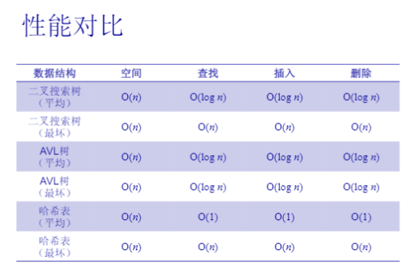

## 八，图

### 图的概念

结构：集合，线性结构，属型结构，图形结构
$$
\text{Graph(V,E)}
$$
where $V$ represents the number of vertices/nodes, and $E$ represents number of edges

无向图 vs 有向图

完全图，path between any two nodes

- 无向完全图 n(n-2)/2 edges
- 有向完全图 n(n-1) edges

稀疏图 (sparse) vs 稠密图（dense）

顶点的度 degree of a node, out degree and in degree

- graph with one node with degree 0 is a tree

路径，路径长度，回路，简单路径 (no repeated nodes)，简单回路 (no repeated nodes except start/end)

连通图 vs 强连通图

- connected graph, 无向图, any two nodes are connected
- strongly connected graph, 有向图，directed edge between any two nodes (in both ways)
- 连通分量 

极小连通子图，smallest connected graph graph with $n$ vertices has $n-1$ edges

### 图的存储表示

邻接矩阵（数组）adjacency matrix

- 优点 easy to operate on, 缺点 takes up a lot of unnecessary space when there aren't a lot of edges

邻接表（链式）adjacency list


### 图的遍历与连通性

graph traversal, starting from one node and getting to another node

深度优先搜索 vs 广度优先搜索

### 最小生成树

minimum cost spanning tree, often denoted as mst

- sum of all the edges is the smallest possible

- n-1 edges, therefore no cycles

Kruskal 算法

1. order edges from least to greatest ()
2. pick the smallest edge 
3. check if that edge creates loop, if it doesn't, consider it as part of mst
4. repeat from 2 until there are n-1 edges selected

- 时间复杂度 $O(n)=(E\log E)$, based on sorting algorithm, we can use mergesort or minheap

Prims 算法

1. pick the smallest edge
2. pick the next smallest edge that will be connected to the current tree
3. continue with no loops
4. 时间复杂度$O(n)=(E\log(V))$

### 最短路径

Dijkstra

Belford Ford

Floyd Warshall

