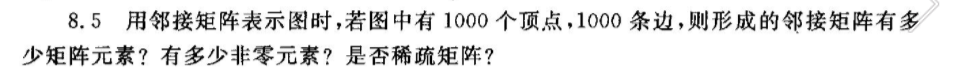

# 数据结构， 所有课堂测试 ，作业

## 作业

### 作业一 （10，10）

1.14  填空题

1. 在线性结构，树形结构和图形结构中，之间前驱和直接后续结点之间分别存在着**one to one**， **one to many**，和**many to many**，的联系
2. 当一个传至型形式参数所点的体积较大时，应最好说明为**reference（引用）**， 以节省参数之的传输时间和存储参数的空间
3. 在函数中对引用型形式参数的修改就是对相应**actual parameter value（实际参数的直）**的修改,而对**pass by value (传直型)**型形式参数的修改只局限在该函数的内部，不会反映到对应的世纪参数上

### 作业二 （8、10）


### 作业三

3.1 铁路进行列车调度时，常把站台设计程栈式结构的站台，如图3.28所示式，试问：

1. 设有编号为1，2，3，4，5，6的6量列车，顺序开入栈式结构的站台，则可能出战列有多少种？

   【解】这是用排列组合算出来的Catalan数
   $$
   C_n = \frac{(2n)!}{(n+1)!(n)!}
   $$
   $P = \frac{(12!)}{(7!)(6!)} = 132$

   若进站的6量列车顺序如上所述，那么是否能够的到435612，325641，154623和135426的出战序列，如果不能，说明为什么能，如果能，说明如何得到（即写出“进栈”或“出战“的序列）

   435612 不能，3-6已经出战，剩下12，1先进站，不能比2早出站

   325641 能， 1进站，2进站，3进站，3出站，2出站，4进展，5进站，5出战，6进站，6出站，4出站，1出站

   154623 不能， 1，4，5，6 已出站，剩下23，2先进站，不能比3早出站

   135426 能，1进站，1出站，2进站，3进站，3出站，4进站，5进站，5出站，4出站，2出站，6进站，6出站

3.4  写出下列中缀表达式的后缀形式

4. $ (A + B) * D + E / ( F + A * D ) + C $

   【解】

   ```
   AB+D*EFAD*+/+C+
   ```

5. $ ! (A \&\& !((B < C )\vert\vert (C > D))) || (C < E)$ 

   【解】 ！！ A = A

   ```
   A!BC<CD>||||CE<||
   ```

### 作业四 （10，10）

设有一个双端队列，元素进入该队列的顺寻时1，2，3，4. 试分别求出满足下列条件的输出队列

1. 能由输入受限的双端队列得到，但不能有输出受限的双端队列得到的输出序列
2. 能由输出受限的双端队列得到，但不能由输入受限的双端队列得到的输出序列
3. 不能由输入受限的双端队列得到，又不能由输出受限的双端队列得到的输出序列

【解】

输出受限
$$
\rightleftharpoons  [\space\space\space][\space\space\space][\space\space\space][\space\space\space] \leftharpoonup
$$
输入受限
$$
\rightleftharpoons  [\space\space\space][\space\space\space][\space\space\space][\space\space\space] \rightharpoonup
$$

1. 4 1 3 2
2. 4 2 1 3
3. 4 2 3 1

### 作业五（10，10）

4.2 设有一个$n\times n$的对称矩阵A，如图4.34(a)所示。为了节约存储，可以只存对角线以上的元素，或者只保存对焦线或对焦线以下的元素。前者称为上三角矩阵，后者称为下三角矩阵。我们把他们安行存放于一个以为数组B中，如图4.34(b)和图4.34(c)所示。并称之为堆成矩阵A的压缩存储方式。试问

1. 存储对称矩阵A上三角部分或下三角部分的一维数组B有多少元素？
   $$
    \frac{n *(n+1)}{2}
   $$

2. 若在以为数组B中从0号位置开始存放，则如图4.34(a)所示的对称矩阵中的任一元素$a_{ij}$在只存上三角部分的情形下（图4.34(b)）应存于一维数组的什么小标位置？给出计算公式
   $$
   j(j-1) / 2 + i - 1
   $$

3. 若在一维数组B中从0号位置开始存放，则如图4.34(a)所示的堆成矩阵中的任一元素$a_{ij}$在只存下三角部分的情形下（图4.34(c)）应存于一维数组的什么下标位置？给出计算公式
   $$
   i(i-1)/2 + j - 1
   $$


4.7 稀疏矩阵（sparse matrix）的三元组表可以用代行指针数组的二元组表代替。稀疏矩阵有多少行，在行指针数组中就有多少个元素：第i个元素的数组下标i代表矩阵的第i行，元素的内容即为稀疏矩阵第i行的第一个非零元素在二元组表中的存放位置。二元组表中每个二元组只记录非零元素的列好和元素值，且各二元组安行号递增的顺序排列。试对图4.37素偶是的系数矩阵，分别建立它的三元组表和带行指针数组的二元组表。


### 作业六（0，10） 未交

4.9. 对目标 T = “ababbaabaa"， 模式 P = "aab", 按KMP算法进行快速模式匹配，并用图分析计算过程


4.10 画出下列广义表的图形表示和他们的存储表示

1. $D(A(c), B(e), C(a, L(b,c,d)))$
2. $J1(J2(J1, a, J3(J1)), j3(J1))$


### 作业七（6，10）题目做错了（做了5.8）

 5.6  5.18

5.18 已知一颗二叉数的谦虚遍历的结果试ABECDFGHIJ, 中序遍历的结果试EBCDAFHIGJ, 试画出这颗二叉树


### 作业八 （0）未交

5.13


1. 层号为h的结点数目为$k^{h-1}$
2. 编号为i的父节点（若存在）是$\lfloor (i-2)/k  + 1\rfloor$
3. 编号为i的结点的第m个孩子节点的结点编号是$k*(i-1)+1+j$
4. 编号为i的结点有右小兄弟的条件是（i-1）能被k整除，右校内各地的编号是i+1
5. 如结点个数为你n,, 深度为「$log_kn$」+1

### 作业九（10，10）

5.15 5.20


### 作业十 （10，10）

7.3 7.10


叶节点插入二叉搜索树吗？


### 作业十二（10，10）

7.15, 6.9, 6.10


### 作业十三

8.3, 8.5


n个顶点的连通图至少有n-1边

n个顶点的连通图至少有n边




有$1000^2=1,000,000$ 个元素，无向图有2000个非零元素，有向图有1000个非零元素，是稀疏矩阵


## 课堂测试

### 0223 (100)

1D 2E 3C 4F

### 0225 (100)

1.B 2.C 3. d!

### 0302 (100)

1C 2D 3B

### 0304 (100)

1D 2B 3C

### 0309 (100)

1A 2C 3B

### 0311 (100)

1C 2A 3D

### 0316 (100)

1D 2B 3C

### 0318 (33)

1A 2A 3A wrong 1B 2C 3A

### 0323 (50)

1B 2B wrong? 

### 0325 (100)

1C 2B 3B

### 0330 (100)

1B 2A 3C

### 0406 (66)

1D 2C 3C wrong 

### 0408 (66)

中序 52136748

前序 12546378

层次 12456837

wrong  答案说明

中序： 25136748 

前序：12546378 

层次：12456837

### 0415（66）

1C 2 n+1? 3A 

wrong?

### 0420 （100）

1C 2C 3B

### 0427 （100）

1D 2C 3B

### 0429 （33）

1A 2B 3A wrong 1A 2D 3C

### 0511 (100)

1C 2D 3C

### 0518 (66)

1D 2A 3A wrong?

### 0525 (100)

1A 2C 3D

已知一个稀疏矩阵有m行，n列和t个非零元

利用三元组表的存储表示，矩阵转置的不不素算法的时间复杂度

子女兄弟表示

子女表示·	