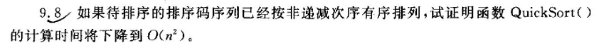
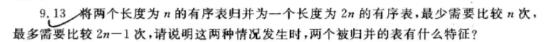

# 数据结构 hw15

9.8, 9.13

如果待排序的n个对象的程序已经按排序吗非递减次序有排序，假设排序的时间代价为$T(n)$。当第一个对象用作reference对象时，partition算法会用一次，比较$n-1$排序代码。整个序列只能分为两部分，左子序列为空，有子序列就是正确序列。$n-1$个对象的非递减有序序列，对于递归的quicksort，成本为
$$
T(n-1) = (n-1) + T(n-1)\\
= (n-1) + \{(n-2) + T(n-2)\} \\
...\\
= (n-1) + (n-2) + (n-3) + ... +2 + 1\\
= n(n-1)/2 = O(n^2)
$$

最少的比较次数：若A表所有元素都小于（或大于）B表元素，A[0]比较B[0]-B[n-1]直接并

最多的比较次数：A和B量表互相交错，则A表的每一个元素需要和B的每一个元素比较。A[0]与B[1]比较，能确定其中一个元素的位置，然后，剩下一个还要与另一表中下一个元素比较一次。除了最后一个元素外，每个元素都要比较两次，侧需要比较此等于2n-1次

