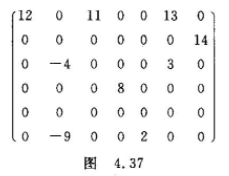
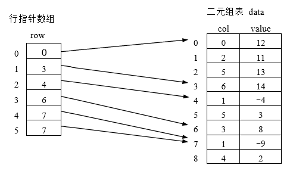

# 数据结构 hw5

计 83 李天勤 2018080106

4.2 设有一个$n\times n$的对称矩阵A，如图4.34(a)所示。为了节约存储，可以只存对角线以上的元素，或者只保存对焦线或对焦线以下的元素。前者称为上三角矩阵，后者称为下三角矩阵。我们把他们安行存放于一个以为数组B中，如图4.34(b)和图4.34(c)所示。并称之为堆成矩阵A的压缩存储方式。试问

1. 存储对称矩阵A上三角部分或下三角部分的一维数组B有多少元素？
   $$
    \frac{n *(n+1)}{2}
   $$
   

2. 若在以为数组B中从0号位置开始存放，则如图4.34(a)所示的对称矩阵中的任一元素$a_{ij}$在只存上三角部分的情形下（图4.34(b)）应存于一维数组的什么小标位置？给出计算公式
   $$
   j(j-1) / 2 + i - 1
   $$
   

3. 若在一维数组B中从0号位置开始存放，则如图4.34(a)所示的堆成矩阵中的任一元素$a_{ij}$在只存下三角部分的情形下（图4.34(c)）应存于一维数组的什么下标位置？给出计算公式
   $$
   i(i-1)/2 + j - 1
   $$
   

4.7 稀疏矩阵（sparse matrix）的三元组表可以用代行指针数组的二元组表代替。稀疏矩阵有多少行，在行指针数组中就有多少个元素：第i个元素的数组下标i代表矩阵的第i行，元素的内容即为稀疏矩阵第i行的第一个非零元素在二元组表中的存放位置。二元组表中每个二元组只记录非零元素的列好和元素值，且各二元组安行号递增的顺序排列。试对图4.37素偶是的系数矩阵，分别建立它的三元组表和带行指针数组的二元组表。

