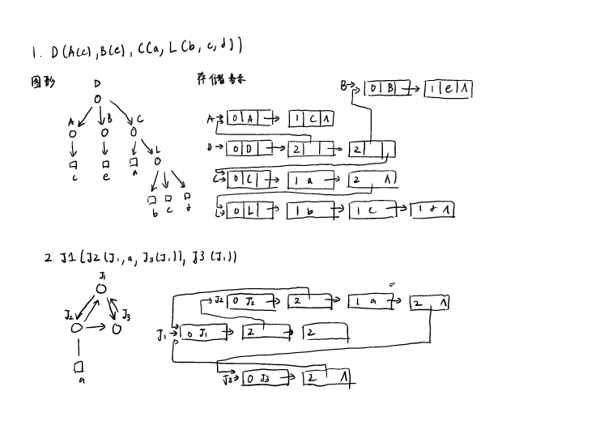

# 数据结构 hw6

第4章 数组，串与冠以表 4.9, 4.10

4.9. 对目标 T = “ababbaabaa"， 模式 P = "aab", 按KMP算法进行快速模式匹配，并用图分析计算过程

4.10 画出下列广义表的图形表示和他们的存储表示

1. $D(A(c), B(e), C(a, L(b,c,d)))$
2. $J1(J2(J1, a, J3(J1)), j3(J1))$

answer chapter 5.