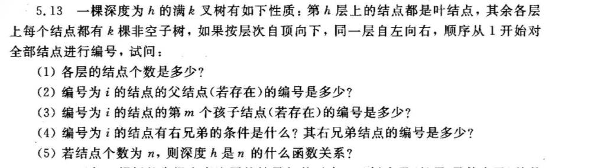

# 数据结构 hw8

5.13

1. 层号为h的结点数目为$k^{h-1}$
2. 编号为i的父节点（若存在）是$\lfloor (i-2)/k  + 1\rfloor$
3. 编号为i的结点的第m个孩子节点的结点编号是$k*(i-1)+1+j$
4. 编号为i的结点有右小兄弟的条件是（i-1）能被k整除，右校内各地的编号是i+1
5. 如结点个数为你n,, 深度为「$log_kn$」+1

