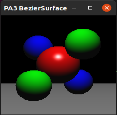
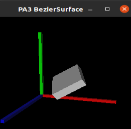
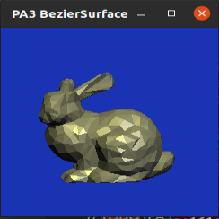
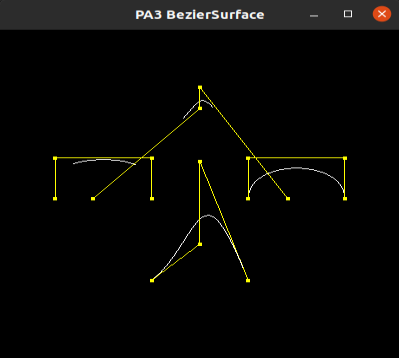
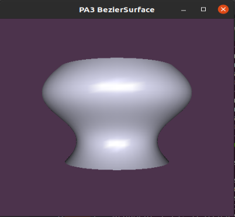
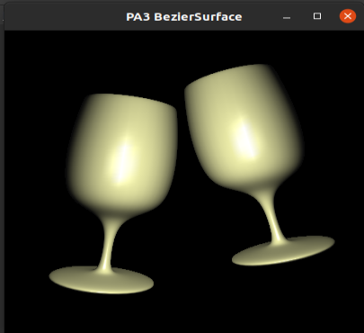

# 图形学实验 PA3 参数曲线和曲面

计83 李天勤 2018080106

## 实验目的

Grasp a better understanding of parametric curves by implementing Bezier curves, B-splines and surfaces of objects generated by the rotation of a fixed axis. In this experiment, we are still utilizing the OpenGL framework just as in the previous programming assignment

## 实验实现

After migrating the code that we have already written from PA1 and PA2, we had to implement the `BezierCurve` and `BsplineCurve` class, more specifically, the `virtual void discretize(int resolution, std::vector<CurvePoint>& data) = 0;` function. The function gives us `controls` which are our control points, and`resolution` , which describes the resolution of the discretization.

We can model off the code from ```basis.py``` 

## 实验结果

The results are as shown

|  |  |  |
| ------------------------------------------------------------ | ------------------------------------------------------------ | ------------------------------------------------------------ |
|  |  |  |

From this we can see that our implementation of the Bezier curve and B-spline curve are correct

## 实验分析

- Bezier 曲线和 B 样条曲线有什么异同?怎样绘制一个首尾相接且接点处也有连续性质的B 样条?

  【解】

  异

  - Bezier curve does not support local modification and editing. In other words, every point in the curve is affected by each control point. Changing one control point will every point in the curve.
  - Very difficult to maintain geometric continuity when splicing Bezier curves
  - For a B-splice curve, the number of control points have nothing to do with the order of the parametric curve, and thus it has a higher degree of freedom,  being able to have more control points without worrying about the curve order causing higher computation costs

  同 

  - Both Bezier curves and Bspline curves are polynomial parametric curves that cannot represent some basic curves such as circles.
  - Bezier curve is just a special case of Bspline curve.

- 阅读 revsurface.hpp 中绘制旋转曲面的代码,简述其主要绘制逻辑。

  【解】

  First obtain a list of the vertices and tangent directions that the curve will be rotated, then specify each rotation step, which is $2\pi/\text{step}$. Each rotation calculates a rotation vector about the angle of rotation, and multiplies this vector with the vertex and tangent direction of the curve to be rotated to obtain the vertex and tangent of the rotated curve, and then rotate this vertex and the next vertex by four points before and after the rotation. The quadrilateral part formed by the vertices forms two triangles, which are all added to the triangle face vector forming the revolving surface. Then draw all the triangles on the surface in order to draw the surface formed by revolution.

-  你在完成作业的时候和哪些同学进行了怎样的讨论?是否借鉴了网上/别的同学的代码? 【解】没有
