# 图形学实验2：OpenGL 绘制

计83 李天勤 2018080106

## 实验目的

The purpose of this lab assignment is to become familiar with OpenGL, an application programing interface designed for rendering 2D and 3D graphics. It contains a library of functions that can be utilized to render the same pictures as in the previous assignment, in which we implemented the Ray Casting algorithms for Spheres, Planes, and Triangles, and Polygon Meshes. We had to implement the intersection functions. 

## 实验实现

In this lab, we simply had to copy over those algorithms that we had already defined, write a couple of lines and let OpenGL do its work. We simply had to tell OpenGL the shape of the object, and OpenGPL will handle operations such as depth test, coloring, and rasterization. We only had to realize a small part of ```mian.cpp```

```c++
// TODO (PA2): Turn On all lights.
// TODO (PA2): Draw elements.
for (int i = 0; i < sceneParser->getNumLights(); ++i)
sceneParser->getLight(i)->turnOn(i);

sceneParser->getGroup()->drawGL();
```

and ```mesh.hpp```'s ```drawGL()```

```c++
void drawGL() override {
    // TODO (PA2): Call drawGL for each individual triangle.
    for (int triId = 0; triId < (int)t.size(); ++triId) {
        TriangleIndex &triIndex = t[triId];
        Triangle triangle(v[triIndex[0]], v[triIndex[1]], v[triIndex[2]],  material);
        triangle.normal = n[triId];
        triangle.drawGL();
    }	
}
```

## 实验结果

Test Case 1

| 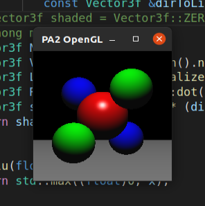 | 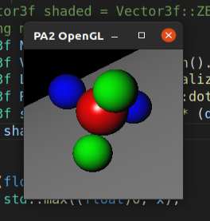 |
| ------------------------------------------------------------ | ------------------------------------------------------------ |

Test Case 2

| 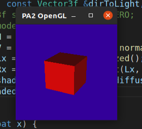 | 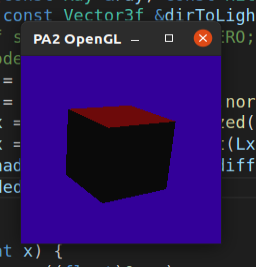 |
| ------------------------------------------------------------ | ------------------------------------------------------------ |

Test Case 3

| 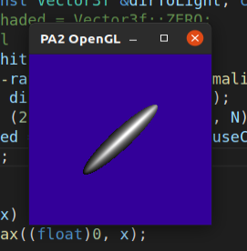 | 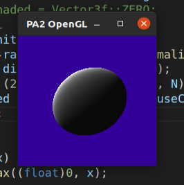 |
| ------------------------------------------------------------ | ------------------------------------------------------------ |

Test Case 4

| 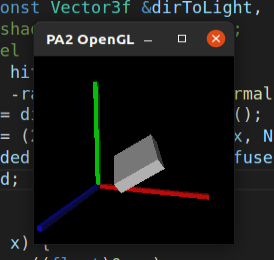 | 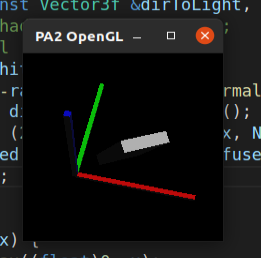 |
| ------------------------------------------------------------ | ------------------------------------------------------------ |

Test Case 5

| 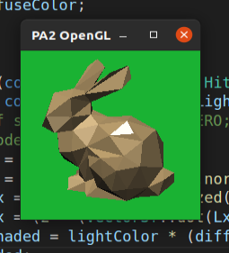 | 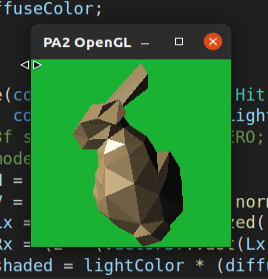 |
| ------------------------------------------------------------ | ------------------------------------------------------------ |

Test Case 6

| 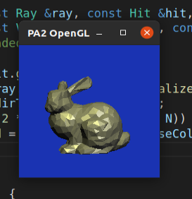 | 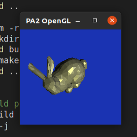 |
| ------------------------------------------------------------ | ------------------------------------------------------------ |

Test Case 7

| 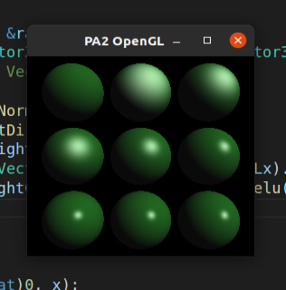 | 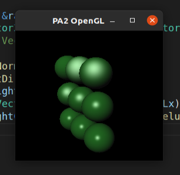 |
| ------------------------------------------------------------ | ------------------------------------------------------------ |


## 实验分析

你在OpenGL 的环境配置中遇到了哪些问题？是怎么解决的？

I ran and tested on a Ubuntu VirtualBox, and I ran into no problems

结合核心代码分析使用OpenGL 的绘制逻辑和光线投射的绘制逻辑有什么不同？

The logic of ray casting is to simulated a ray emitted from the camera to all pixels on the canvas, then find the intersection point of this ray with all objects in the scene, while utilizing the Phong model to accumulate the contribution of each ray and object material on the color of each object.On the other hand, OpenGL targets each object and each light source. First, turn on all the light sources as a global variable. Then call the drawGL() function once for each object, and save the corresponding material, object shape and position in the OpenGL 3D state machine. Finally, specify a camera through gluPerspective(), and OpenGL automatically renders the scene seen by the camera.

你在完成作业的时候和哪些同学进行了怎样的讨论？是否借鉴了网上/别的同学的代码？

I did not discuss with other students, nor did I use code found online or from classmates