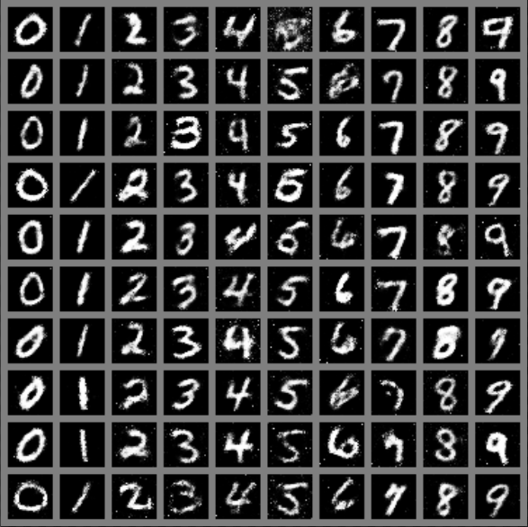

# 图形学实验PA4：Conditional Gan

计83李天勤2018080106

## 实验环境

I ran this code in a lab's server, running Ubuntu 18.04.5 LTS with the following configurations

```
CPU(s) 40
Model Name: Intel(R) Xeon(R) CPU E5-2650 v3 @ 2.30GHz
```

I created a virtual environment using `conda` and used python version `3.8`. In the virtual environment, I simply ran

```
pip install jittor
```

and ran the code 

```
python3.8 PA4_CGAN.py
```

I ran it with the default arguments of 100 epochs, the results looked as such

```
...
[Epoch 99/100] [Batch 600/938] [D loss: 0.051288] [G loss: 0.767122]
[Epoch 99/100] [Batch 650/938] [D loss: 0.065136] [G loss: 0.771544]
[Epoch 99/100] [Batch 700/938] [D loss: 0.050528] [G loss: 0.807709]
[Epoch 99/100] [Batch 750/938] [D loss: 0.073955] [G loss: 0.778852]
[Epoch 99/100] [Batch 800/938] [D loss: 0.044973] [G loss: 0.791490]
[Epoch 99/100] [Batch 850/938] [D loss: 0.054876] [G loss: 0.728524]
[Epoch 99/100] [Batch 900/938] [D loss: 0.043485] [G loss: 0.845365]
```

## 实验结果

The first epoch, represented by `0.pg` looked like this


The second epoch looked like this, 


and so on

| 10000.png                                                    | 15000.png                                                    | 20000.png                                                    |
| ------------------------------------------------------------ | ------------------------------------------------------------ | ------------------------------------------------------------ |
|  |  |  |

and the last epoch (93000.png) looked as such, 


The result of my school id in `result.png`


We can see that it is correct!