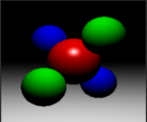
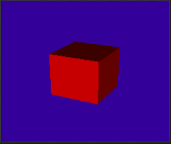
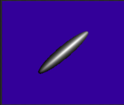
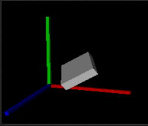
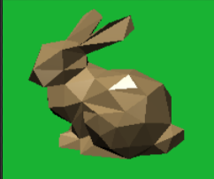
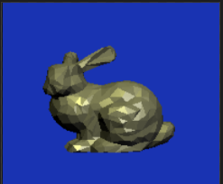
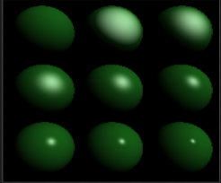

# 1计算机图形学 PA1

计 83 李天勤 2018080106

## 实验目的

Implementation of the Ray Casting Algorithm as mentioned in class. Implement simple rendering engine that supports the rendering of a variety of basic geometrix bodies including spheres, planes, and triangles, and add basic Phong like material. 

The ray casting algorithm is given to us as shown in the introduction, our goal is to implement the persepctive camera, the ray generator, and intersection algorithms for each the geometric shapes. There are many implementations of these interesection algorithms, but I used the ones as discussed in the lectures.

## 实验实现

The algorithm for finding intersection points of different geometric shapes and light rays is implemented using the parametric representation of light. 
$$
P(t) = R_o +tR_d
$$
where $R_o$ is defined as $[x_o, y_o, z_o]$ and represents the origin of the ray. $R_d$ is defined as $[x_d, y_d, z_d]$ and represents the direction of d. When $R_d$ is normalized, then $t$ equals the distance of the ray from origin in world coordinates. Thus, the problem becomes finding what $t$ equals for the following different geometric shapes. But first, we need to define the camera mode and the phong coloring algorithm. 

### Camera

The parameters and algorithm for the camera mode, in this case the Pinhole Camera, are already well defined in the introduction. 

### Phong

The parameters and algorithm for Phong modeling is also well defined in the introduction. 

### Intersection

First we had to construct a data structure that could store all the ```Object3D's``` located in ```group.hpp```. I simply created a ```Object3D``` vector that would store all the objects that were parsed. The intersection method would check if the light ray intersected any of the geometric objects within the group (each group represent the geometric shapes within a image).  The intersection methods are inherited by each of the following geometric classes.

### Plane

A plane is defined as 
$$
Ax + By +Cz + D = 0
$$
subsituting this into the equation for a ray, and solving for $t$
$$
t = -(Ax_o+ By_o +Cz_o +D) / (Ax_d +By_d +Cz_d)
$$

$$
t = - (P_n \cdot R_o + D) / (P_n \cdot R_d)
$$

where $P_n$ is the normalized plane. If $(P_n \cdot R_d) = 0$, it means the ray is parrallel to the plane, thus no intersection. If it doesn't equal zero, we can continue.

$t$ must satisfy the following conditions
$$
t > 0
$$
At first I had trouble understanding what exactly the sign of $t$ tells us. But after some research, I found out it is the sign of the demonentator that affects how we define the intersection.

- When demonenator is negative, it represents intersection with the front face of the plane.  Or, in otherwords, the normal vector points toward the origin, or toward the ray.  
- When denomenator is positive, it represents interesection with the back face of the plane. Or, in otherwords, the normal vector points away from the origin, or away from ray.

Since $t$ has to be positive, we have to account for intersections of the second type, when the denomenator is zero. In order to account fot his, we simply adjust by multiplying the plane's normal by -1. And thus the interesection will once again be with the front of the plane. As shown in the pseudo code

```c++
float j = Vector3f::dot(this->normal, ray_direction);
float t = (this->d + Vector3f::dot(this->normal, ray_origin)) / j;

if( -1.0 * j >  0) h.set(t, this->material, this->normal);				// when dom < 0
else if (-1.0 * j < 0) h.set(t, this->material, -1 * this->normal);		// when dom > 0
```

### Sphere

A sphere can be implemented by finding the values in the following picture, 


where the circle represents the sphere and P1 and P2 represents the two points that the ray intersects.

First, we can find the distance from from the ray's origin to the ray's center
$$
l = P_c - R_0
$$
Then we can find $tc$ using some trigometry, 
$$
tc = l \cdot R_d
$$
it must satsify $tc > 0$, or otherwise, the ray does not intersect the sphere, instead it points away. If it does statisfy the requirement, then we continue.

The distance from the center of the sphere to the ray is 
$$
d^2 = l^2 - t_c^2
$$
it must satisfy $d^2 \leq r^2$ or else the ray doesn't intersect the sphere. If it fails to satisfy the condition, it means that $t1c$ will give us a point outside of the sphere, and our ray doesn't intersect at all. If it does satisfy the requirement, then we can continue.

Now that we have $t_c$ and $d$, it is pretty to find the value of $t1c$, which can be found using 
$$
t1c^2 = r^2 - d^2
$$
Using $t1c$, we can thus solve for solve for the two rays $t1,t2$
$$
t1 = tc - t1c  \\
t2 = tc + t1c 
$$
$t1$ represents if the light source is outside the ball, and $t2$ represents if the ball if its within the ball. And using this, we can find the ```Hit``` points, or points of intersection $P1, P2$
$$
P1 = Origin + Direction * t1 \\
P2 = Origin + Direction * t2
$$

### Triangle

Using verticles to represent triangles
$$
P0, P1, P2
$$
the interesection point between the ray and the trianglular plane is 
$$
P = (1-\beta-\gamma)P_0 + P_1 + P_2
$$
where
$$
E_1 = P_0 - P_1 \\ E_2 = P_0 - P_2 \\ S = P_0 - R_0
$$
allows us to derive 
$$
\begin{pmatrix} t \\ \beta \\ \gamma \end{pmatrix} = \frac{1}{\det{(R_d,E_1,E_2)}}
\begin{pmatrix} \det{(S, E_1, E_2)} \\ \det{(R_d, S, E_2)} \\ \det{(R_d, E_1, S)}\end{pmatrix}
$$
that satisfies the following conditions
$$
t > 0 \\0 \leq \beta, \gamma \leq 1 \\ \beta + \gamma \leq 1 
$$
where the triangle normal vector is equal to the cross product between two of the edges
$$
E_1 \times E_2
$$

## 实验结果

```
$ bash code/run_all.sh
```

|  |  |  |  |
| ------------------------------------------------------------ | ------------------------------------------------------------ | ------------------------------------------------------------ | ------------------------------------------------------------ |
|  |  |  |                                                              |

## 实验分析

As we can see from the tests, the algorithms we have implemented to find the intersection value, or the value of $t$ for each geometric shape, was successful, allowing us to get computer generated images.

