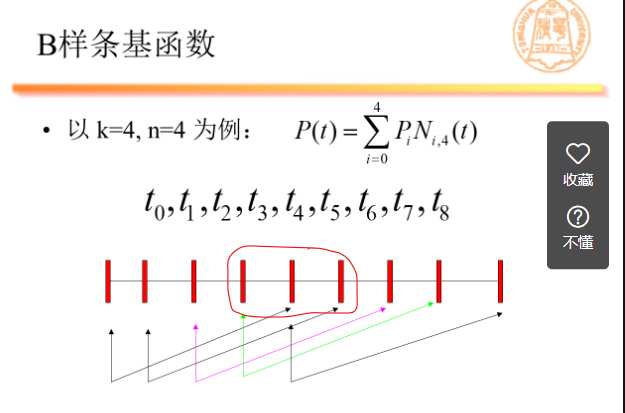

# 4.6 第7讲

Beizer - parametric curve used in computer graphics. 

- related to the Berstein Polynomial
- defined by a set of control points P0 to Pn where n iscalled its "order", first and last control points are the endpoints

B样曲线 (B spline) 

- spline function : function denoted by peicewise polynomials
- interpolation (插值) : estimation, method of constructing new data points wihtin the range of a discrete set of known data points

### 为什么学习样条？

a lot of pro's, but how to solve the con's?

- Beizer曲线、曲面不支持局部的修改和编辑
- 拼接时，满足集合连续性条件时十分困难的

B样条 vs Beizer?

> There is no difference between a B-spline curve and a curve that consists of Bezier curves as segments because a B-spline curve is a curve that consists of Bezier curves as segments. However, there is indeed differences between a B-spline curve and a Bezier curve. For Bezier curves, changing any control point will affect the shape of entire curve. For B-spline curves, changing any control point will only affect (degree+1) Bezier segments.

Similar Curves?

> B-spline curve is not the only type of curve that consists of Bezier curves as segments. Catmull-Rom spline and cubic Hermite spline are two such examples and both of which can be converted into the form of B-spline curves.

### 如何理解B样条？

插值？interpolation

节点? knots, points where pieces (of piecewise meet)

- knot span (vector of knots)

阶? degree

- lower the degree, closer a B-spline curve follows its control polyline 
- degree of polynomial 

B样条基函数 de Boor-Cox recursion method

- Berstain Basis Function

only circled part is defined (k-1, n + 1)

分类

- 均匀 uniform
- 准均匀 quasi-uniform
- 分段 peicewise

NURBS non-uniform ration B-spline 

