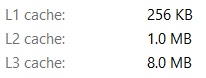
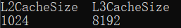

# 系统结构 lab1

计 83 李天勤 2018080106

## 实验目的

1. understand devices Cache settings
2. use Cache's 局部性（时间局部性和空间局部性）原理 to optimize program

## 实验内容

1. 构造测试用例，通过测量执行时间验证自己机器的L1 和L2Cache 大小
2. 构造测试用例，通过测量执行时间验证自己机器的L1 Cache Line 大小
3. 构造测试用例，通过测量执行时间验证自己机器的L1 Cache 的相联度
4. 利用自己机器的Cache 配置完成一个矩阵乘法代码的优化

## 本机Cache Size

I used an Lenovo ThinkBook 14s-IWL with a  i7 8th Generation (8565U). Using task manager, I found that the cache sizes were 



but using ```wmic cpu get L2CacheSize, L3CacheSize``` in command prompt, I recieved the following, 



So the L1/L2/L3 Caches are 256KB/1024KB/8192KB

However, I ran all of my code in a virtualbox environment running Ubuntu 20 (64 bit). Using ```lscpu | grep cache``` , I was able to get

```
L1d cache:                       32 KiB
L1i cache:                       32 KiB
L2 cache:                        256 KiB
L3 cache:                        8 MiB
```

## 1. 测量L1 Data Cache Size 和 L2 Cache Size

### Code

```c++
// 测量 L1 Data Cache Size 和 L2 Data Cache Size
#include "stdio.h"
#include <time.h>

using namespace std;
int main() {
    int arrlen = 1;
    clock_t start, end;
    int i = 1;
    // steps 4, 16, 32, 64
    int step = 4;
    // number of accesses
    int period = 1024 * 8;
  	int src = 0;
    // 从4KB到32768KB作测试
    while (i <= 32768) {
        arrlen = i * 1024; // 1KB = 1024B
        int *arr = new int[arrlen]; 
      	int pos = 0;
        start = clock();   
        for (int j = 0; j < period; j++) {
            src = arr[pos];
            pos = (pos + step) % arrlen;
        }
        end = clock();
        printf("array size = %dKB, time = %ld ms\n", i * 4, end - start);
        delete[] arr;
        i = i * 2;
    }
}
```

### Results

Access array 8192 times (does not change), change the array size and use different steps size. Running the code using 

```
g++ -D_GNU_SOURCE 1.cpp -o prog && ./prog
```

we get the following results

Step Size: 4

```
array size = 4KB, time = 89 ms
array size = 8KB, time = 83 ms
array size = 16KB, time = 89 ms
array size = 32KB, time = 84 ms
array size = 64KB, time = 93 ms
array size = 128KB, time = 91 ms
array size = 256KB, time = 165 ms
array size = 512KB, time = 171 ms
array size = 1024KB, time = 109 ms
array size = 2048KB, time = 100 ms
array size = 4096KB, time = 101 ms
array size = 8192KB, time = 143 ms
array size = 16384KB, time = 103 ms
array size = 32768KB, time = 175 ms
array size = 65536KB, time = 128 ms
```

Step Size: 16

```
array size = 4KB, time = 89 ms
array size = 8KB, time = 132 ms
array size = 16KB, time = 91 ms
array size = 32KB, time = 83 ms
array size = 64KB, time = 93 ms
array size = 128KB, time = 90 ms
array size = 256KB, time = 127 ms
array size = 512KB, time = 216 ms
array size = 1024KB, time = 165 ms
array size = 2048KB, time = 164 ms
array size = 4096KB, time = 185 ms
array size = 8192KB, time = 160 ms
array size = 16384KB, time = 167 ms
array size = 32768KB, time = 177 ms
array size = 65536KB, time = 161 ms
array size = 131072KB, time = 184 ms
```

Step Size: 32

```
array size = 4KB, time = 91 ms
array size = 8KB, time = 85 ms
array size = 16KB, time = 93 ms
array size = 32KB, time = 85 ms
array size = 64KB, time = 94 ms
array size = 128KB, time = 93 ms
array size = 256KB, time = 122 ms
array size = 512KB, time = 172 ms
array size = 1024KB, time = 245 ms
array size = 2048KB, time = 255 ms
array size = 4096KB, time = 271 ms
array size = 8192KB, time = 246 ms
array size = 16384KB, time = 238 ms
array size = 32768KB, time = 245 ms
array size = 65536KB, time = 410 ms
array size = 131072KB, time = 239 ms

```

Step Size: 64

```
array size = 4KB, time = 80 ms
array size = 8KB, time = 88 ms
array size = 16KB, time = 80 ms
array size = 32KB, time = 81 ms
array size = 64KB, time = 90 ms
array size = 128KB, time = 88 ms
array size = 256KB, time = 147 ms
array size = 512KB, time = 165 ms
array size = 1024KB, time = 338 ms
array size = 2048KB, time = 489 ms
array size = 4096KB, time = 387 ms
array size = 8192KB, time = 467 ms
array size = 16384KB, time = 385 ms
array size = 32768KB, time = 434 ms
array size = 65536KB, time = 407 ms
array size = 131072KB, time = 406 ms
```

From the results above, we can see there are large jumps around 256KB, 1024KB, and 8192KB, which shows what oure L1, L2, L3 cache size is.

## 2. 测量 L1 Cache Line Size 

Intel  Core i7/i5/i3 队友每个层级都使用64B的 Cache Line Size ( Cache Line = Cache Size / Cache Line Size )

Using the code above, 4096 KB size array, access count of 2048 times, step count 4B TO 8KB

### Code 

```c
// 测量 L1 Cache Line Size
#include "stdio.h"
#include <time.h>

int main() {
    clock_t start, end;
    int i = 1;
    int step = 1;
    int period = 2048;
    // array of size 4096KB
    int size = 1024 * 1024; 
    int *arr = new int[size];
    int pos = 0;                  
    while (step < 1024 * 4) {
      start = clock();
      for (int j = 0; j < period; j++) {
          arr[pos] = 1;
          pos = (pos + step) % size;
      }
      end = clock();
      printf("step = %dB, time = %ld ms\n", step * 4, end - start);
      step *= 2;
    }
    delete[] arr;
}
```

### Results

```
akashili17@akashili17:~/Documents/isa/lab1$ g++ 2.cpp -o prog && ./prog
step = 4B, time = 34 ms
step = 8B, time = 49 ms
step = 16B, time = 48 ms
step = 32B, time = 32 ms
step = 64B, time = 63 ms
step = 128B, time = 88 ms
step = 256B, time = 134 ms
step = 512B, time = 347 ms
step = 1024B, time = 714 ms
step = 2048B, time = 22 ms
step = 4096B, time = 21 ms
step = 8192B, time = 21 ms
```

It is easy to see, from access steps 128B to 1024B, the time it took increased greatly,  thus the L1 Cache Line has a size of 64B

## 3. 测量 L1 Cache 的相联度

### Method and Method Proof

Just as described in the 实验说明书, we will use an array space that is twice the size of L1 cache (256KB ```int[1024 * 64]```), divide it into $2^n$blocks, and access the odd block in turn. When access slows down, the cache 相联度 is $2^{n-2}$

Proof : 

Assuming that the  相联度 is $2^k$, the block access time is $2^m$ blocks, and the cache capcity is $C$, the cache row size is $L$, then the size of each cahce group is $C/2^k$, containing $C/2^kL$ cache rows, and the memory size of each block is $C/2^{M-1}$, including $C/2^{M-1}L$ cache rows.

 $$k = M-1 $$, the odd block can just fill all parts of the cache line, and there is no cache missing except for the first access

However, if $$M $$continues to grow, more than $$C / 2 ^ KL $$ memory regions in the same group will be accessed. At this time, cache conflicts will occur. In the process of cycling each memory block, cache loss will occur when accessing the following blocks, thus significantly reducing the access speed. Therefore, when the access speed slows down from block $2^m$, then we can get a 相联度 of $2^{m-2}$

### Code

```c
#include "stdio.h"
#include <time.h>

using namespace std;
int main() {
    clock_t start, end;
    int n = 0;
    int nblock = 1;
    // 2x L1 Cache Size of 258KB, for array size
    int size = 1024 * 64;
    int visit_times = 1024 * 8;
    // access amount is size / 2
    int *arr = new int[size];
    int blocklength = size;
    while (nblock < size / 8) { 
        nblock *= 2;
        n += 1;
        blocklength /= 2;
        start = clock();
        for (int j = 0; j < (visit_times * 2 / nblock); j++)
            for (int i = 0; i < nblock; i += 2)
                arr[i * blocklength + j] = 1;
        end = clock();
        printf("n= %d, time = %ld ms\n", n,  end - start);
    }
}
```

### Results

```
akashili17@akashili17:~/Documents/isa/lab1$ g++ 3.cpp -o prog && ./prog
n= 1, time = 35 ms
n= 2, time = 34 ms
n= 3, time = 20 ms
n= 4, time = 95 ms
n= 5, time = 76 ms
n= 6, time = 88 ms
n= 7, time = 119 ms
n= 8, time = 56 ms
n= 9, time = 85 ms
n= 10, time = 31 ms
n= 11, time = 39 ms
n= 12, time = 19 ms
n= 13, time = 18 ms
```

As we can see, the time greatly increases at $n=4,n=5$， L1 Cache Line 相联度 equals $2^3 = 8$

## 4. 矩阵乘法运算的优化

Original Time 

```
time spent for original method : 3.14903 s
time spent for new method : 3.28151 s
time ratio of performance optimization : 0.95963
```

### Optimization Method 1: 

Due to the spatial locality of refrence principle, the matrix b would be stored in the cache following the row first form but the access is being made in column first form, resulting in a lot of cache misses and thus increasing the time it takes to complete the program. To make it more cache friendly, we could simply take the transpose of B and store it and multiply them row wise.  Below is the edited part of the code

```c

// optimization method 1: take transpose of B, then multiply
int (*bT)[1000] =new int[1000][1000];
memset(bT, 0, 1000 * 1000 * sizeof(int));   

// transpose
for (i = 0; i < 1000; i++) 
    for( j = 0; j < 1000; j++) 
        bT[j][i] = b[i][j];
// mult
for (i = 0; i < 1000; i ++)
    for (j = 0; j < 1000; j ++)
        for (k = 0; k < 1000; k ++)
            d[i][j] += a[i][k] * bT[j][k];

```

Results 

```
time spent for original method : 3.40632 s
time spent for new method : 2.21745 s
time ratio of performance optimization : 1.53614
```

### Optimization Method 2

Using a loop next optimization method, which, by definition use loop transformations for locality optimization and parallelization. In terms of matrix multiplication, machines typically do just one memory operation per multiply-add, so values loaded must be reused at least twice. By calculating a small block of entries simultaneously, the following loop reuses each loaded value twice, so that the inner loop has four loads and four multiply–adds, thus solving this problem.

```c
 int (*aT)[1000] = new int[1000][1000];
memset(aT, 0, 1000 * 1000 * sizeof(int));

int steps = 2;
for (i = 0; i < 1000; i += steps) {
    for (j = 0; j < 1000; j += steps) {
        int c1, c2, c3, c4;
        c1 = c2 = c3 = c4 = 0;
        for (k = 0; k < 1000; k += 1) {
            c1 += b[k][j + 0] * a[i + 0][k];
            c2 += b[k][j + 1] * a[i + 0][k];
            c3 += b[k][j + 0] * a[i + 1][k];
            c4 += b[k][j + 1] * a[i + 1][k];
        }
        // d[i][j] += a[i][k] * bT[j][k];
        d[i + 0][j + 0] = c1;
        d[i + 0][j + 1] = c2;
        d[i + 1][j + 0] = c3;
        d[i + 1][j + 1] = c4;
    }
}
```

### Results

```
time spent for original method : 3.86651 s
time spent for new method : 1.90323 s
time ratio of performance optimization : 2.03155
```

I had also attempted a block partitioning method but it did not have performance optimization on par with the two above.

