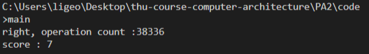

# 系统结构 Lab2

计 83 李天勤 2018080106

## 实验目的

1. 理解各类Cache侧信道攻击的工作机理
2. 实现Cache侧信道攻击，获取目标信息（实现getAns接口）
   1. 当访存指令的目标地址在cache中时，可直接从cache中获取数据，减少指令执行时间。
   2. 从访存指令执行时间可以反推出目标地址是否在cache中。
   3. 利用cache时间侧信道，进程可以推断出cache的状态，从而了解到其它进程的访存情况。

## 实验实现

There are three different methods of minimizing the access count

1. use multiple cache line's to carry out multiple attack at the same time
2. use multiple side channel attacks to reduce the possible range of unknown addresses
3. use the state of the last attack to reduce the initialization steps

During the attack, that if there is a hit in the Cache and memory access time is reduced, then we can deduce from the execution time of the memory accesses instruction whether or not $u$ is in the Cache.  

In my algorithm, I first confirmed which line of the Cache the unknown address $u$ is stored in through direct mapping. Using the feature of direct mapping, I then traverse all the addresses that will be mapped into the line and then judge whether it is the target address based on the running time.

The process is shown in the code below and the explanation is shown in the comments: 

```c++
int Solver::getAns(BaseCache* cache, int addresses, int lines) {
	// TODO 
	// clear cache 	
	cache->flushAny();
	// conform which line u is in
	cache->accessu();
	
	int cache_line_num = 0;
	int delay_short = 0;
	int delay_long = 1;
	// search the 32 lines
	for(int i = 0; i < lines; i++) {
	// delay time is short, then it means its a hit
	// if it is not hit, the address i may replace the address u or the address i and the address u exist at the same time, 
	// then visit address i and then visit the u , if the delay time is long, it indicates that u has been replaced, then u 		is stored in the ith line.
        if(cache->access(i) == delay_short) return i;
        // confirm line where u is, if valid data, return cache line_num
        // correctly map known address u to ith line
        else if(cache->accessu() == delay_long) { 
            cache_line_num = i;
            break;
        }
	}
	// search among all addresses that are in the cache line_num
	// use the line number 32 as the step size to clear all the addresses i.
	// only when u == i can it hit and be cleared successfully, thus successfuly attacking the unknown address
	for(int i = cache_line_num; i < addresses; i += 32) 
		if(cache->flush(i) == delay_long) return i;		
}
```


## 实验结果



As we can see from the results, we can get a memory access count of 38366 times, which is more than enough to get a score a full score of 7.

## 实验分析

### 思考题

1. 如何采取一些措施，防御你使用的cache时间侧信道攻击，并简述措施的有效性？

There are many methods to prevent channel attacks on the cache times we use. 

1. Cache Partitioning - cache partitioning refers to dividing the cache into cache blocks to be used by different process, each process can only access its own cache block, minizing cache conflicts between the victim's process and attackers's process.

   Examples

   1. Partition Locked (PL) Cache - every cache line in the PL cache can have it's "protection bit" set or cleared. the protected bit cannot be replaced by non-protected lines (or the attackers data). this method prevents random address flush

2. Cache Randomization - cache randomization refers to randomizing the mapping from memory address to cache sets

   Examples

   1. Randomized Permutation Cache - use dynamic permutation tables to map memory address to cache sets. each secure process has a distinct permutation table, and the index bits are translated using the table to find the reach cache set index. thus, if a vitim's memory acess is mapped to a cache set that belongs to another process, that other process will be evicted, but still swap the index mappings between that other process's cache set.