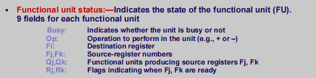
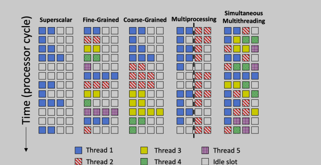

# 系统结构allnotes

# SEC 1： Introduction

计算机的层次结构

了解计算机的硬件组成，五大组成部件

什么是计算机系统能力？（1）系统观（2）系统方法

# SEC 2： Computer Architecture， What， How， and Why

not a hardware course, but system course, incorporating IO system, memory systems, and cpu

- ISA, Machine Organization, Machine Implementation

**what is ISA?** abstract model of computer, the realization of an ISA, such as the CPU is an implementation, defines the supported data types, registers, and hardware support for managing main memory. often the bridge between operating system (or program) and microarchitecture (alu, cpu, etc)

**three elements to performance?** algorithm compiler, and hardware

**six great ideas in ca?** 1. layers of representation/interpretation 2. Moore's law 3.principle of locality/memory hierarchy 4. parallelism 5. performance measurement & improvement 6. dependability via redundancy

**what is amdahl's law?** formula which gives the theoretical speedup in latency of the execution of a task at fixed workload that can be expected of a system whose resources are improved

- $Fe$ proportion of execution time that is the part benefiting from improved resources 

- $Se$ is the speedup of the part of the task that benefits from improved system resources
- $T_0$ is the initial speed before improved system

$$
S_n = \frac{T_0}{T_n} = \frac{1}{(1-Fe) + \frac{Fe}{Se}}
$$

- check law for multiple optimization

law for parallel processing

- $p$ processes
- $x$ percent of the program is $p$-way parallelable

$$
S_{par} = \frac{1}{\frac{x}{p} + (1-x)}
$$

- key challenge in parallel programming is increasing large x for large p

**three design principles?** 

1. critical path design
2. bread and butter design
3. balanced design 

**design points?** performance, reliability, availability, cost, power, time to market

# SEC3: Instruction System Architecture

Architecture (1) visible to the software (2) operation code, data type, addressing

Microarchitecture (1) not visible to software (2) caches? (3) branch prediction (4) instruction cycles (5) pipeline

**principle of data representation?** (1) shorten the running time of the program (2) reduce amount of communication between CPU and main memory (3) versatility and utilization of this data representation

## 寻址技术 addressing technology

### 编址方式 

assign access code to each storage unit,  addressing unit, memory logically forms a linear address space after being addressed, 

1. 零地址空间个数?
2. 并行存储七的编址技术
3. 输入输出设备的编址

### 寻址方式

method in which processor finds effective address according to the address information given in the instruction, method to determine the data address of this instruction and the address of the next instruction to be executed

1. 设计思想

2. 寄存器寻址优缺点

3. 堆站寻址方式

4. 间接寻址方式与编址寻址方式的比较 （indirect addressing mode and indexed addressing mode

   - immediate - loads direct values into registers or memory locations

   - register- simply moves data in or out of registers

   - direct - instruction contains memory address to access 

   - indirect - loads a value from the address indicated by a register `MOV eax, [esi]`

   - base pointer similar to indirect but adds constant value to address of the register 

   - indexed - instruction contains a memory address to access, and also specifies an index register to offset that address `MOV eax, string_start[ebx * 2]`

     

### 定位方式

determine the physical address of the main memory of the program determined

程序需要定位的主要原因（1）独立性（2）模块设计（3）运行中大小变化（4）有些程序大小超过主存分配空间

1. 直接定位方式 
2. 静态定位
3. 动态定位

## 指令格式的优化设计

指令的组成

操作吗的优化表示

1. 固定长度
2. Huffman编码
3. 扩展编码

## 指令系统的功能设计

### 基本指令系统

### 指令系统的性能

### 指令系统的优化设计

## RISCV 指令系统

## VLIW 指令系统

# SEC4: Memory Hierarchy Cache 1

memory system - buffer, prefetch, memory hierarchy

**four questions for memory hierarchy?**

1. where can a block be placed in the upper level? (block placement: direct mapped, fully associative, set associative)
2. how is block found if it is in upper level (of cache?)
3. which block should be replaced on a miss? (block replacement algorithms)
4. what happens on a write? write strategy

what helps performance? (no increase in clock speed) doing more work in one clock cycle with more parallelism in one thread, better branch perdition, cache policies, memory organizations, and thread level parallelism

how to improve cache performance? reduce the miss rate, reduce the miss penalty or reduce the time to hint in the cache (average memory access time)
$$
AMAT = HitTime + MissRate \space\cdot\space MissPenalty
$$

- latency - time for a single access
- bandwidth - number of accesses per unit time

- temporal locality and spatial locality

what are the cache algorithms? 

- https://courses.cs.washington.edu/courses/cse378/09wi/lectures/lec15.pdf

- placement - fully associative, set associative, direct mapped
- direct mapped cache (each address in main memory maps to unique address in cache block), direct map address selection, hash address, 2 way set

**what are block replacement algorithms? **random, LRU, FIFO, NLRU, One-bit

**what happens on a write?** 

- write through - information is written to both the block in the cache and to the block in the lower-level memory
- write back - information is written only to the block in the cache

**what are memory stall cycles?** the number of cycles during which the processor is stalled waiting for a memory access
$$
\text{memory stall cycles = IC} \times \frac{\text{memory accesses}}{\text{instruction}} \times\text{miss rate} \times \text{miss penalty}
$$
where miss penalty depends on (1) prior memory requests or memory refresh, different clocks of the processor, bus, and memory

# SEC5 Cache Design Continued

### CPU and Memory Hierarchy

### Memory Organization

**where do misses come from?** (1) compulsory (2) capacity (3) conflict (4) coherence

### Cache Organization

1. change block size, first reduces compulsory misses but can lead to increased conflict misses, lower latency + bandwidth -> increase block size
2. change cache internal organization, reduce capacity misses
3. change associativity, 
4. change compiler,
5. compiler optimizations, loop interchange, blocking, merging, loop fusion

https://stackoverflow.com/questions/8107965/concept-of-block-size-in-a-cache

https://courses.cs.washington.edu/courses/cse378/09au/lectures/cse378au09-20.pdf

**which reduction methods apply to cache 2?** 

1. reduce capacity misses via larger cache
2. reduce compulsory misses via larger block size
3. reduce conflict misses via higher associativity
4. reduce conflict misses via way prediction/pseudo associativity
5. reduce conflict/capacity misses vs compiler optimizations

**miss penalty reducing techniques?**

1. multilevel caches
2. critical word first and early restart 
3. giving priority to read misses or writes
4. merging write buffer 
5. victim caches

**hit time reduction?**

1. small and simple caches
2. avoiding address translation

# SEC6 Writing Cache Friendly Code

### instruction vs data caches

- unified, dynamic sharing of cache space, no over provisioning that might happen with static partitioning, but instructions and data might thrash each other, I and D are accessed in different places, where do we place the unified cache for fast access?
- first level caches are always split, second and higher levels are almost always unified
- performance of 1-level split cache

### miss rate examples

## writing cache friendly code with temporal locality and spatial locality

# SEC7 Conflict Free Access to Parallel Memory

### 并行访问存储器

1. 方法：把m字w位的存储器改编成位m/n字nxw位的存储器
2. 逻辑实现 divide the address code into two parts, one is the address of the memory, and the other is responsible for selecting the data

- Main disadvantage: large access conflict
(1) Instruction fetch conflict (branch)
(2) Read operand conflict
(3) Write data conflict
(4) Read and write conflict (read and write the same memory word)

### 交叉访问存储器

1. 高位交叉访问存储器，扩大存储容量，用地址码的高位部分区分存储体号
2. 地位交叉访问存储器，提高存储器访问速度

### 无冲突访问存储器

# SEC8 Pipelining

5 components

1. instruction fetch : 获取指令
2. registor decoder :获取寄存器，指令译码
3. execution， 计算内存地址
4. memory，从数据存储器中读数据
5. write， 向寄存器文件写回数据

### 流水线技术

1. 空间并行性（设置多个独立的操作部件，multiprocessor, superscalar），时间并行性
2. 工作原理，分类，线性与非线性性能分析和技术

### 流水线工作原理

1. 流水线锁存器
2. 流水线的表示方式
3. 流水线时空图
4. 流水线的主要特点

### 流水线分类

**linear and nonlinear pipelining?**

**according to level of pipeline?** （指令流水线，操作流水线）

**unifunction vs multifunction pipelines?** pipeline with fixed/dedicated function known as unifunctional, multifunctional pipeline may perform different functions either at different times or at the same time

**static vs dynamic pipelines?** static pipeline only has one function at a time (unifunctional or multifunctional), dynamic pipeline processor permits several functional configurations to exists simultaneously, must be multifunctionaly 

others 1. 标量流水线和向量流水线 2. 同步流水线和异步流水线 3.顺序流水线与乱序流水线

### 流水线的性能分析

1. 吞吐率
2. 加速比
3. 效率 $E = \frac{n个任务占用的时空区}{k个流水段的总时空区} = \frac{T_0}{k\cdot T_k}$

### 非线性的的调用技术

The task of nonlinear pipeline scheduling is to find a minimum cycle period, and input new tasks to the pipeline according to this cycle. The various functional segments of the pipeline will not conflict, and the pipeline has the highest throughput and efficiency.

1. 非线性流水线的表示

   1. 预约表

2. 非线性流水线的冲突

   1. 启动距离，连续输入i盎格任务之间的时间间隔

      冲突，几个任务争用同一个流水线

3. 无冲突调度方法

   1. 禁止启动集合，冲突向量

禁止启动集合

## 超标量处理机

https://en.wikipedia.org/wiki/Superscalar_processor

基本结构，

单发射与多发射？单发射only one instruction is fetched in each cycle, only one is instruction is decoded, etc. Can be implemented with basic pipeline. 多发射 each cycle fetches,decodes, executes, etc multiple instructions at the same time.Need multiple instruction units for each acction, 

多流水线调度，

资源冲突，

超标量处理机性能

# SEC9 流⽔线的静态调度 

hazards https://en.wikipedia.org/wiki/Hazard_(computer_architecture)#Control_hazards_(branch_hazards_or_instruction_hazards)

ILP, Static Explotation

instruction level pipeline - basic block, loop level parallelism

avoid data dependencies 

name dependencies

control dependencies

pipeline cpi = ideal pipeline cpi + structural stalls + raw stalls + +war stalls +waw stalls + controll stalls

# SEC10 流⽔线动态调度

ILP, dynamic exploitation

delay slot, software pipeline

## dynamically scheduled pipelines

scoreboarding? ainstructions execute whenever not dependent on previous instructions and no hazards

1. issue - decode instructions and check for structural hazards
   - instructions issued in program order, don't issue if structural hazard, don't issue if instruction is output dependent on any previously issued but incomplete instruction
2. read operands -wait until no data hazards, then read operands,  resolve raw hazards, since we wait for all instructions to write back to data 
3. execution - operate on operands 
4. write results, stall until no war hazards

three parts of scoreboard?

1. instruction status 

2. functional unit status

   

3. register result status

tomalsulo's algorithm, loop example

# SEC12 Tomasulo with ROB (reorder buffer)

## Dynamic Branch Prediction

# SEC13 Register Renaming

eliminate name dependence (and hence WAR and WAW)

static renaming

can be done dynamically in hardware

tomalsulo's algorithm vs scoreboard

| Tomasulo's Algorithm                                         | Scoreboard Algorithm            |
| ------------------------------------------------------------ | ------------------------------- |
| controll and buffers distributed                             | control and buffers centralized |
| FU buffers are known as "reservation station" to control execution, having pending operands, acts as interlock permits |                                 |
| registers in instructions replaced by values or pointers to reservation stations, known as register renaming, avoids WAR, WAW hazards |                                 |
| Results to FU from RS, not through registers over, Common Data Bus that broadcasts results to all FU's |                                 |

# SEC15 Branch Prediction

what are branches, instructions which can alter the flow of instruction execution in a program

- branch prediction is more important today

control flow penalty 

branches and jumps

1. is the preceding instruction a taken branch?
2. if so what is target address?

branch penalties limit performance of deeply pipelined processors, modern branch predictors have high accuracy and can reduce branch penalties significantly

1. prediction structures: branch history tables, target buffers
2. misprediction recovery mechanisms

# SEC16 Vector Processing

Flynn Categories

1. SISD
2. MISD
3. SIMD
4. MIMD

3 kinds of parallelism

1. instruction-level parallelism, multiple instructions from one instruction stream are executed simultaneously. 
2. thread-level parallelism, multiple instruction streams are executed simultaneously
3. vector data parallelism, same operation is performed simultaneously on arrays of elements

effect of splitting into multiple processors?

- reduces horizontal wastes
- leaves some verticle wastes, and puts upper limit on peak throughput of each thread

vector instruction set advantages

1. compact, one short instruction encodes N operations
2. expressive, tells hardware that these N operations are 
   1. independent, use same functional unit, access disjoint registers, access registers in same pattern as previous instructions, access a contiguous block of memory, access memory in a known pattern

functional units?

interleaved vector memory system, bank busy time - time before bank ready to accept next request

向量的数据表示

- adopt pipeline structure, with multiple pipelines working in parallel
- large supercomputer, composed of a microcomputer and a vector coprocessor
- general vector computer includes a high-performance scalar processor
- the problem must be converted into a vector processor to function
- vector balance point (vector balance point): in order to equalize the utilization of vector hardware devices and scalar hardware devices, the percentage of vector code in a program.

### 向量的处理方式

### 向量处理机的结构

### 提高向量处理机性能的用技术

寄存器-寄存器结构, set up vector registers that can be accessed quickly to store vectors, destination vectors, and intermediate results, input and output ends of the arithmetic components are connected with teh vector register to form register register operation pipeline

1. In the grouping processing method of vectors, there is no restriction on the vector length N, but the group length n is fixed.

different types of cases

1. 指令不相关
2. 功能部件冲突
3. 愿寄存器冲突, two instructions use the same source register as resource
4. 结果寄存器冲突, use the same result vector register

vector chaining

### 向量处理机性能评价

1. 向量指令的处理时间$T_{vp}$
2. 向量长度位无穷大时的向量处理机的最大性能
3. 版性能常量长度
4. 向量长度临界值

# SEC17 Interconnection and Communication

## 互联网络概念

交换方式

1. circuit switching - physical path between source node and destination node remains connected during the entire data transmission
2. packet switching - divide the information into many groups, and send them to the interconnected network separately, these packets can be transmitted through different paths.
3. wormhole switching

网络拓扑结构， dynamic vs static

互联函数

1. 恒等函数
2. 方体函数
3. 洗牌函数

## 静态网络

特点与指标

典型的静态网络

the static network is directly connected by points to points, and this connection method will not change during the execution of the program.

- if represented by a graph, the node represents the switch and the edge represents the communication link
- the link between nodes is passive and cannot be reconstructed

## 动态网络

The switching elements of the network are active, and the link can be reconstructed by setting the state of these switches.

### Crossbar Switch

Only the switching elements on the boundary of the network can be connected to the processor.

Greatly broaden the interconnection transmission frequency band and improve the efficiency of the system;

1. however, the amount of crossbar switch equipment is too large and cost too high, we need to adopt a space allocation system

### 多级互联网络

1. The three elements of a multi-level network
(1) Switch unit: a switch unit with input and a output is recorded as a switch unit of axa, where a is an integer multiple of 2. Common ones are 2 x 2, 4 x 4, 8 x 8, etc.
According to the function of the switch unit, 2 x 2 can be divided into two function and four function switch

## 通信问题

1. 信息，包和片

# SEC18 Data-Level Parallelism

