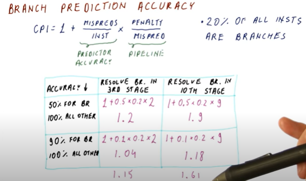

# 高性能计算

# 第一讲

high performance computing / supercomputing

- use parallel processing 

hpc rankings 

- TOP500 https://www.top500.org/project/ (处理线性代数)
- HPCG http://hpcg-benchmark.org/ ()
- Graph500 https://graph500.org/?page_id=12 (处理图)
- IO500 https://io500.org/about (系统的存储性能)

集群架构 cluster，multiple multi-core 服务器 interconnected through high speed network is known as super computer

Strong scaling is defined as how the solution time varies with the number of processors for a fixed total problem size.  (keeps problem size the same )

Weak scaling is defined as how the solution time varies with the number of processors for a fixed problem size per processor. (keep process number same, change problem size)

## Links and other study material

nonblocking communication mpi https://pdc-support.github.io/introduction-to-mpi/06-nonblocking/index.html

cuda, openmp, mpi concurrency https://www.arc.vt.edu/wp-content/uploads/2015/04/2012Fall_Hybrid_CUDA.pdf

mpi vs openmp https://stackoverflow.com/questions/32464084/what-are-the-differences-between-mpi-and-openmp

openmp notes: https://nanxiao.gitbooks.io/openmp-little-book/content/posts/private-firstprivate-and-lastprivate-clauses.html

cuda and gpu hiearchy https://stackoverflow.com/questions/2207171/help-me-understand-cuda/2213744#2213744

branch prediction

